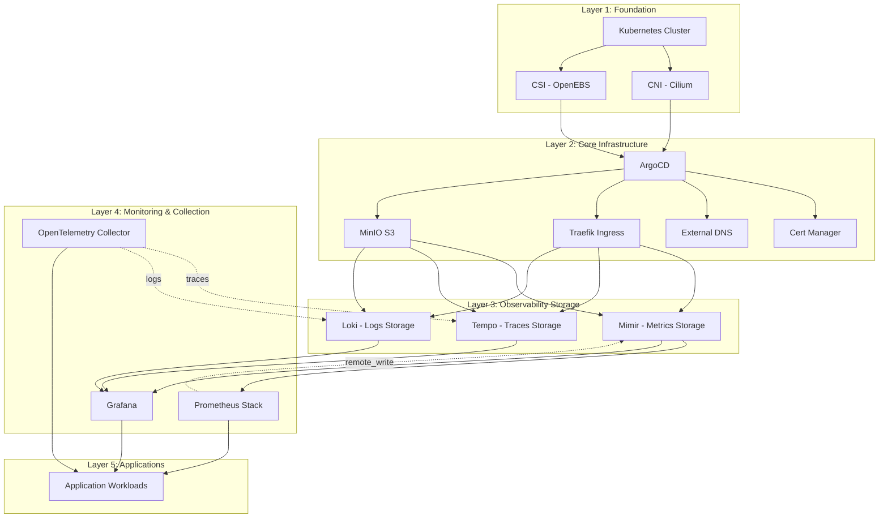
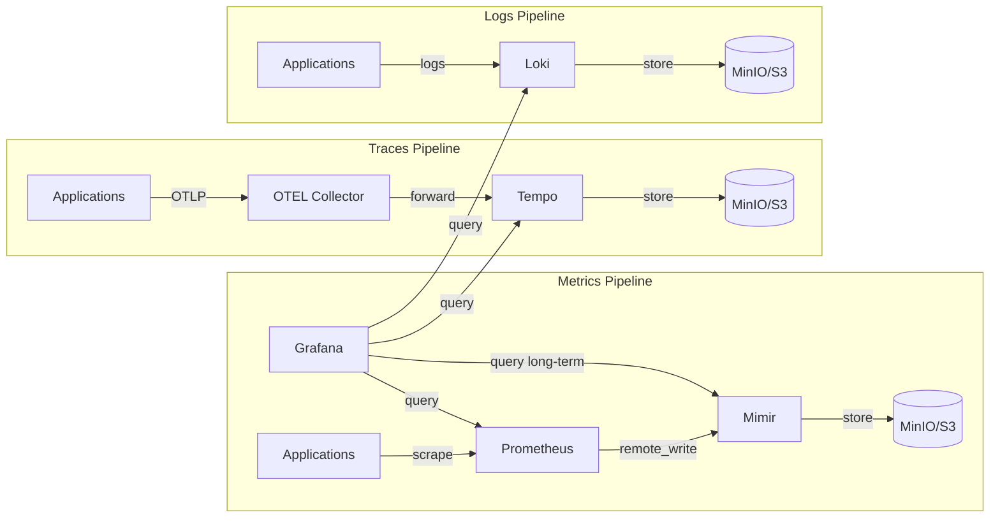

# Kubelab Architecture & Deployment Order

## Architecture Diagram

## Data Flow Diagram

## Deployment Priority Order

### Phase 1: Foundation (Required First)
1. Kubernetes Cluster
2. CNI (Cilium)
3. CSI (OpenEBS)

### Phase 2: Core Infrastructure
4. ArgoCD (GitOps Controller)
5. Cert Manager (TLS Certificates)
6. External DNS (DNS Automation)
7. Traefik (Ingress Controller)
8. MinIO (Object Storage)

### Phase 3: Observability Backend
9. Mimir (Long-term Metrics Storage)
   - Requires: MinIO buckets (mimir-blocks, mimir-alertmanager, mimir-ruler)
10. Tempo (Traces Storage)
11. Loki (Logs Storage)

### Phase 4: Monitoring & Visualization
12. Prometheus Stack (Metrics Collection)
    - Configured with remote_write to Mimir
13. OpenTelemetry Collector (Traces/Logs Collection)
14. Grafana (Visualization)
    - Datasources: Prometheus, Mimir, Tempo, Loki

### Phase 5: Applications
15. Application Workloads
    - Instrumented with metrics endpoints
    - OTLP traces to OpenTelemetry

## Component Relationships

| Component | Depends On | Provides To | Purpose |
|-----------|-----------|-------------|---------|
| **Kubernetes** | - | All | Container orchestration |
| **Cilium** | Kubernetes | All pods | Network connectivity & security |
| **OpenEBS** | Kubernetes | StatefulSets | Persistent storage |
| **ArgoCD** | K8s, CNI, CSI | All apps | GitOps deployment |
| **Cert Manager** | ArgoCD | Ingresses | TLS certificate management |
| **External DNS** | ArgoCD | Ingresses | Automatic DNS records |
| **Traefik** | ArgoCD, Cert Manager | Services | Ingress routing |
| **MinIO** | ArgoCD, OpenEBS | Mimir, Tempo, Loki | S3-compatible object storage |
| **Mimir** | MinIO, Traefik | Prometheus, Grafana | Long-term metrics storage |
| **Tempo** | MinIO, Traefik | OTEL, Grafana | Distributed tracing backend |
| **Loki** | MinIO, Traefik | Apps, Grafana | Log aggregation |
| **Prometheus** | Mimir | Grafana, Apps | Metrics collection & alerting |
| **OTEL Collector** | Tempo | Apps | Traces/logs collection |
| **Grafana** | Prometheus, Mimir, Tempo, Loki | Users | Unified observability UI |

## Key Integration Points

### Prometheus → Mimir
\`\`\`yaml
remoteWrite:
  - url: http://mimir-nginx.mimir.svc:80/api/v1/push
    headers:
      X-Scope-OrgID: kube-prometheus-stack
\`\`\`

### Grafana Datasources
\`\`\`yaml
- Prometheus: http://kube-prometheus-stack-prometheus.kube-prometheus-stack.svc:9090
- Mimir: http://mimir-nginx.mimir.svc.cluster.local:80/prometheus
- Tempo: http://tempo-gateway.grafana-system.svc.cluster.local
- Loki: http://loki-stack.monitoring.svc:3100
\`\`\`

### MinIO Buckets
\`\`\`
- mimir-blocks (Mimir metrics blocks)
- mimir-alertmanager (Mimir alertmanager state)
- mimir-ruler (Mimir ruler state)
- thanos-store (Prometheus long-term storage)
- tempo-traces (Tempo traces)
- loki-chunks (Loki log chunks)
\`\`\`

**⚠️ Important**: Mimir requires separate S3 buckets for blocks_storage, alertmanager_storage, and ruler_storage. Using the same bucket name without different storage prefixes will cause validation errors. Configure in `helm/mimir_values.yaml`:
\`\`\`yaml
blocks_storage:
  s3:
    bucket_name: mimir-blocks
alertmanager_storage:
  s3:
    bucket_name: mimir-alertmanager
ruler_storage:
  s3:
    bucket_name: mimir-ruler
\`\`\`

## Network Flow

\`\`\`
Internet
    ↓
Traefik Ingress (LoadBalancer)
    ↓
┌─────────────────────────────────────┐
│  Internal Services                  │
│  - grafana.local.jazziro.com       │
│  - prometheus.local.jazziro.com    │
│  - argocd.local.jazziro.com        │
└─────────────────────────────────────┘
    ↓
Pod Network (Cilium CNI)
    ↓
Persistent Storage (OpenEBS)
\`\`\`

## Deployment Commands

\`\`\`bash
# Phase 1: Foundation (Manual)
# Deploy Kubernetes, CNI, CSI

# Phase 2: Core Infrastructure
ansible-playbook main.yaml --tags argocd
ansible-playbook main.yaml --tags cert-manager
ansible-playbook main.yaml --tags external-dns
ansible-playbook main.yaml --tags traefik
ansible-playbook main.yaml --tags minio

# Phase 3: Observability Backend
ansible-playbook addons/mimir.yaml
ansible-playbook addons/tempo.yaml
ansible-playbook addons/loki.yaml

# Phase 4: Monitoring
ansible-playbook addons/kube-prometheus-stack.yaml
ansible-playbook addons/grafana.yaml

# Phase 5: Applications
ansible-playbook addons/your-app.yaml
\`\`\`
