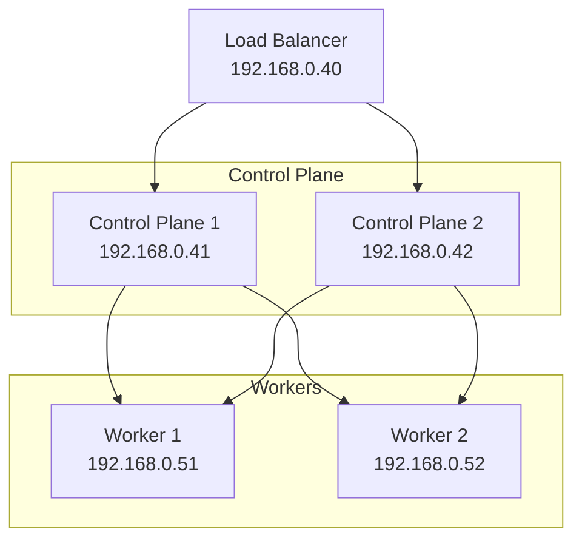

# Kubelab - Production Kubernetes Homelab

A production-grade Kubernetes homelab environment with GitOps, observability, and automation.

## 📚 Documentation

### Getting Started
- [Architecture Overview](docs/architecture.md) - System architecture and component relationships
- [Prerequisites](docs/setup/prerequisites.md) - Required tools and dependencies
- [Installation Guide](docs/setup/installation.md) - Step-by-step cluster deployment
- [Configuration](docs/setup/configuration.md) - Secrets and variables setup

### Guides
- [Ansible Playbooks](docs/guides/ansible-playbooks.md) - Using Ansible for deployment
- [ArgoCD Applications](docs/guides/argocd-applications.md) - Managing applications with GitOps
- [Monitoring Setup](docs/guides/monitoring-setup.md) - Prometheus, Mimir, Grafana configuration
- [Storage Configuration](docs/guides/storage-configuration.md) - NFS and persistent volumes
- [Kubernetes Upgrade](docs/upgrade_k8s.md) - Cluster upgrade procedures
- [OptiPlex NVMe Notes](docs/optiplex_nvme_doc.md) - NVMe/USB adapter notes for OptiPlex
- [Prometheus ServiceMonitor](docs/prometheus-servicemonitor-guide.md) - Creating custom metrics
- [ArgoCD Metrics](docs/prometheus-argocd-metrics.md) - Monitoring ArgoCD

### Reference
- [Available Applications](docs/applications.md) - List of deployable applications
- [Network Configuration](docs/reference/network-configuration.md) - IP addresses and networking
- [Elasticsearch Fleet API](docs/elasticsearch-fleet-api-key-creation.md) - Fleet server setup

### Troubleshooting
- [Common Issues](docs/troubleshooting.md) - Solutions to frequent problems
- [Debugging Guide](docs/troubleshooting/debugging.md) - Troubleshooting techniques

## 🚀 Quick Start

### 1. Clone Repository
```bash
git clone https://github.com/codesenju/kubelab.git
cd kubelab
```

### 2. Configure Secrets
```bash
# Create and encrypt secrets file
ansible-vault create ansible/group_vars/all/secrets.yaml
```

### 3. Deploy Infrastructure
```bash
# Deploy VMs with OpenTofu
cd tofu
tofu init && tofu apply

# Deploy Kubernetes cluster
cd ../ansible
ansible-playbook main.yaml --vault-pass-file=vault-pass.txt
```

### 4. Verify Installation
```bash
# Copy kubeconfig
ssh ubuntu@192.168.0.41 cat ~/.kube/config > ~/.kube/config

# Check cluster
kubectl get nodes
kubectl get pods -A
```

## 🏗️ Architecture



## 🔧 Core Components

| Component | Purpose | Documentation |
|-----------|---------|---------------|
| **ArgoCD** | GitOps continuous delivery | [Guide](docs/guides/argocd-applications.md) |
| **Prometheus Stack** | Metrics collection | [Guide](docs/guides/monitoring-setup.md) |
| **Mimir** | Long-term metrics storage | [Architecture](docs/architecture.md#mimir) |
| **Grafana** | Observability dashboards | [Guide](docs/guides/monitoring-setup.md) |
| **Traefik** | Ingress controller | [Reference](docs/reference/network-configuration.md) |
| **MinIO** | S3-compatible storage | [Architecture](docs/architecture.md#minio) |
| **Cert Manager** | TLS certificate automation | [Setup](docs/setup/installation.md) |

## 📦 Available Applications

Deploy applications using Ansible playbooks:

```bash
# Core infrastructure
ansible-playbook addons/argocd.yaml
ansible-playbook addons/cert-manager.yaml
ansible-playbook addons/traefik.yaml

# Observability
ansible-playbook addons/kube-prometheus-stack.yaml
ansible-playbook addons/mimir.yaml
ansible-playbook addons/grafana.yaml

# Applications
ansible-playbook addons/<application>.yaml
```

See [Available Applications](docs/applications.md) for the complete list.

## 🛠️ Common Tasks

### Deploy New Application
```bash
ansible-playbook addons/<app-name>.yaml --vault-pass-file=vault-pass.txt
```

### Update Cluster
```bash
ansible-playbook main.yaml --tags k8s --vault-pass-file=vault-pass.txt
```

### Enable Volume Expansion
```bash
ansible-playbook main.yaml --tags adhoc,enable_volume_expansion
```

### Create Docker Registry Secret
```bash
kubectl create secret docker-registry dockerhub-secret \
  --docker-server=https://index.docker.io/v1/ \
  --docker-username=<username> \
  --docker-password=<password> \
  --docker-email=<email>
```

## 🔍 Monitoring & Observability

Access dashboards:
- **Grafana**: https://grafana.local.jazziro.com
- **Prometheus**: https://prometheus.local.jazziro.com
- **ArgoCD**: https://argocd.local.jazziro.com

## 🐛 Troubleshooting

### Pods Not Starting
```bash
kubectl describe pod <pod-name> -n <namespace>
kubectl logs <pod-name> -n <namespace>
```

### ArgoCD Sync Issues
```bash
kubectl get applications -n argocd
kubectl describe application <app-name> -n argocd
```

### Certificate Problems
```bash
kubectl get certificates -A
kubectl describe certificate <cert-name> -n <namespace>
```

See [Troubleshooting Guide](docs/troubleshooting.md) for more solutions.

## 📝 Contributing

1. Fork the repository
2. Create a feature branch
3. Make your changes
4. Submit a pull request

## 📄 License

This project is licensed under the MIT License.

## 🙏 Acknowledgments

Built with:
- [Kubernetes](https://kubernetes.io/)
- [ArgoCD](https://argo-cd.readthedocs.io/)
- [Prometheus](https://prometheus.io/)
- [Grafana](https://grafana.com/)
- [OpenTofu](https://opentofu.org/)
- [Ansible](https://www.ansible.com/)
