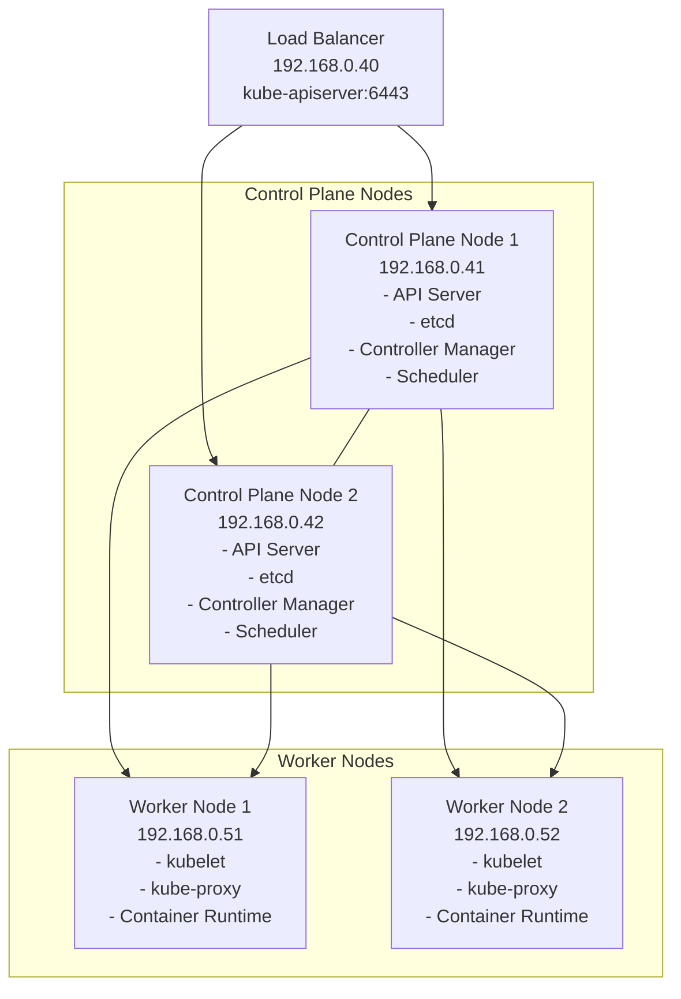

# Kubernetes Cluster Architecture



## Encrypting Secrets with Ansible Vault

Before setting up the cluster, you need to create and encrypt your secrets file using Ansible Vault.

1. **Create the secrets file**  
   Place your secrets in `ansible/groups_vars/all/secrets.yaml` (see the variable examples below).

2. **Encrypt the file with Ansible Vault**  
   Run the following command and set a strong password when prompted:
   ```bash
   ansible-vault encrypt ansible/groups_vars/all/secrets.yaml
   ```
   _Alternatively, to use a password file:_
   ```bash
   ansible-vault encrypt ansible/groups_vars/all/secrets.yaml --vault-password-file <vault-password-file>
   ```

3. **Edit the encrypted file (optional):**
   ```bash
   ansible-vault edit ansible/groups_vars/all/secrets.yaml --vault-password-file <vault-password-file>
   ```

4. **Apply the Ansible playbook using your vault password file:**
   ```bash
   ansible-playbook main.yaml --vault-pass-file="<vault-password-file>"
   ```

## Configuration Variables
Below are the variables you can configure in your `secrets.yaml`:

```yaml
# ArgoCD Configuration
argocd_openid_client_secret: "<your-client-secret>"
argocd_openid_issuer_url: "<your-openid-issuer-url>"
argocd_openid_redirect_uri: "<your-redirect-uri>"
argocd_domain: "<your-argocd-domain>"

# Cloudflared Configuration
cloudflared_hostname_1: "<hostname-1>"
cloudflared_hostname_2: "<hostname-2>"
cloudflared_hostname_3: "<hostname-3>"
cloudflared_hostname_4: "<hostname-4>"
cloudflared_hostname_5: "<hostname-5>"

# Database and Security
db_encryption_key: "<your-encryption-key>"
authentik_secret_key: "<your-authentik-secret-key>"
authentik_postgresql_password: "<your-postgresql-password>"

# S3 Configuration
s3_access_key: "<your-s3-access-key>"
s3_secret_key: "<your-s3-secret-key>"
s3_endpoint: "<your-s3-endpoint>"

# Ingress Configuration
ingress_httpd_test_host: "<your-httpd-test-host>"

# Gitea Configuration
gitea_db_name: "<your-gitea-db-name>"
gitea_db_password: "<your-gitea-db-password>"
gitea_db_user: "<your-gitea-db-user>"
gitea_db_repmgr_password: "<your-gitea-repmgr-password>"
gitea_admin_username: "<your-gitea-admin-username>"
gitea_admin_password: "<your-gitea-admin-password>"
gitea_admin_email: "<your-gitea-admin-email>"
gitea_domain: "<your-gitea-domain>"
gitea_registration_token: "<your-gitea-registration-token>"
gitea_instance_url: "<your-gitea-instance-url>"
```

- Prerequisites
  - [Proxmox](https://www.proxmox.com/en/products/proxmox-virtual-environment/get-started)
  - Download ubuntu cloud init image and upload to proxmox nodes - https://cloud-images.ubuntu.com/jammy/current/jammy-server-cloudimg-amd64.img
  - If your home network is not `192.168.0.0/24`, modify the configs where necessary in the following files:
    - opentofu/local.tf
    - ansible/inventory.ini
  - [Ansible](https://docs.ansible.com/)
  - [OpenTofu](https://opentofu.org/docs/intro/install/)
## Setup Infrastructure on Proxmox
dir: tofu
```
tofu init
tofu plan -out=plan
tofu apply "plan"
```
- For a detailed documentation on the infrastructure

   - 📁 [Opentofu](./opentofu/README.MD) ← Click to view
## Setup K8s
dir: ansible
```bash
ansible all -m ping
```
```bash
ansible-playbook main.yaml --vault-pass-file="<vault-password-file>"
```
###  Setup kubeconfig on bastion
```bash
ssh -i ../kubelab ubuntu@192.168.0.41 cat /home/ubuntu/.kube/config > ~/.kube/config
```

### Verify that cluster is up and running
```bash
kubectl get no
kubectl get all -A
kubectl get sc
```

# Addons
 Argocd
```bash
ansible-playbook ../addons/argocd.yaml
```
Other Applications
```bash
ansible-playbook ../addons/<application>.yaml
```
## TrueNAS NFS settings (compatible with macos)

Go to your TrueNAS web UI:

- Services → NFS → Configure the share (/mnt/pool1/k8s/nfs)
- Ensure the following settings are applied:
   - Enabled: ✔️
   - Network: 192.168.0.0/24 (or your subnet)
   - Maproot User: root (if needed for macOS compatibility)
   - Maproot Group: wheel (macOS equivalent of root group)
   - Security: sys (for compatibility)
   - Enabled NFSv4: ❌ (macOS often works better with NFSv3)

Mount commands
- Macos

```bash
mount -t nfs -o vers=3,resvport,noatime,nolocks,locallocks 192.168.0.15:/mnt/pool1/k8s/nfs ~/nfs-test
```
- Ubuntu

```bash
sudo mount 192.168.0.15:/mnt/pool1/k8s/nfs nfs-test/
```
-  Windows
  - dism /online /enable-feature /featurename:ServicesForNFS-ClientOnly /all
```powershell
mount -o nolock -o mtype=hard <NFS-Server-IP>:/<share-name> <drive-letter>:
```
```powershell
New-PSDrive -Name "Z" -PSProvider FileSystem -Root "\\<NFS-Server-IP>\<share-name>" -Persist
```
# Testing Gotify Notifications

After deploying Gotify, you can send a test alert using:

```bash
curl "https://gotify.example.com/message?token=my-srecret-token" \
  -F "title=test-alert" \
  -F "message=this is a test alert" \
  -F "priority=5"
```

Replace `my-srecret-token` with your actual Gotify

# adhoc
### Enable volume expansion
```bash
ansible-playbook main.yaml --tags adhoc,enable_volume_expansion
```
# Creating an Image Pull Secret for Docker Hub
```bash
kubectl create secret docker-registry dockerhub-secret \
  --docker-server=https://index.docker.io/v1/ \
  --docker-username=<your-dockerhub-username> \
  --docker-password=<your-dockerhub-password> \
  --docker-email=<your-email>
```
# Edot
### Annotate a specific deployement:
```bash
# Nodejs
export app_name=myapp
kubectl patch deployment $app_name -p '{"spec":{"template":{"metadata":{"annotations":{"instrumentation.opentelemetry.io/inject-nodejs":"opentelemetry-operator-system/elastic-instrumentation"}}}}}'

# Dotnet
export app_name=myapp
kubectl patch deployment $app_name -p '{"spec":{"template":{"metadata":{"annotations":{"instrumentation.opentelemetry.io/inject-dotnet":"opentelemetry-operator-system/elastic-instrumentation"}}}}}'

# Python
kubectl patch deployment flaresolverr -p '{"spec":{"template":{"metadata":{"annotations":{"instrumentation.opentelemetry.io/inject-python":"opentelemetry-operator-system/elastic-instrumentation"}}}}}'

# Go
kubectl patch deployment cloudflared -p '{"spec":{"template":{"metadata":{"annotations":{"instrumentation.opentelemetry.io/inject-go":"opentelemetry-operator-system/elastic-instrumentation"}}}}}'
```
### entire namepsace:
```bash
 kubectl annotate namespace jellyfin instrumentation.opentelemetry.io/inject-dotnet="opentelemetry-operator-system/elastic-instrumentation"

 # remove
 kubectl annotate namespace media-stack instrumentation.opentelemetry.io/inject-dotnet-

```
# Opentelemtry
```bash
export service_name=jellyseerr
export deployment_name=jellyseerr
kubectl patch deployment $deployment_name  \
  --type='json' \
  -p='[
    {
      "op": "add",
      "path": "/spec/template/metadata/annotations/instrumentation.opentelemetry.io~1inject-nodejs",
      "value": "true"
    },
    {
      "op": "add",
      "path": "/spec/template/metadata/annotations/resource.opentelemetry.io~1service.name",
      "value": '${service_name}'
    }
  ]'
```
# otel-cli
### Installing
- https://github.com/equinix-labs/otel-cli?tab=readme-ov-file#getting-started
### Usage
```bash
export OTEL_EXPORTER_OTLP_ENDPOINT=localhost:4317
```
#### Linux
```bash
otel-cli span \
    --service "otel-cli" \
    --name "send data to the server" \
    --start $(date -d '5 minutes ago' -u +%Y-%m-%dT%H:%M:%SZ) \
    --end $(date +%s.%N) \
    --attrs "os.kernel=$(uname -r)" \
    --tp-print \
    --verbose
```
#### MacOS
```bash
otel-cli span \
    --service "otel-cli" \
    --name "send data to the server" \
    --start $(date -v-5M -u +%Y-%m-%dT%H:%M:%SZ) \
    --end $(date +%s.%N) \
    --attrs "os.kernel=$(uname -r)" \
    --tp-print \
    --verbose
```
### Context propogation
```bash
# Create parent span and capture the TRACEPARENT from --tp-print output
TRACEPARENT=$(otel-cli span \
    --service "frontend-service" \
    --name "handle-request" \
    --start $(date -v-2M -u +%Y-%m-%dT%H:%M:%SZ) \
    --end $(date -v-1M -u +%Y-%m-%dT%H:%M:%SZ) \
    --attrs "http.method=GET,http.url=/api/users" \
    --tp-print | grep TRACEPARENT | cut -d'=' -f2)

export TRACEPARENT
echo "Parent trace: $TRACEPARENT"


# The TRACEPARENT env var is automatically picked up
otel-cli span \
    --service "backend-service" \
    --name "database-query" \
    --start $(date -v-1M -u +%Y-%m-%dT%H:%M:%SZ) \
    --end $(date +%s.%N) \
    --attrs "db.operation=SELECT,db.table=users" \
    --tp-print \
    --verbose

```
# Issues
***Error***

k8s-worker-1 | UNREACHABLE! => {
    "changed": false,
    "msg": "Failed to connect to the host via ssh: Warning: Permanently added '192.168.0.51' (ED25519) to the list of known hosts.\r\nubuntu@192.168.x.xx: Permission denied (publickey,password).",
    "unreachable": true
}

***Solution***

mv  ~/.ssh/known_hosts  ~/.ssh/known_hosts.bkp

---

***Error***

CRDs stuck in terminating state

***Solution***

kubectl get crd | grep longhorn | awk '{print $1}'
kubectl get crd | grep longhorn | awk '{print $1}' 
kubectl patch crd backuptargets.longhorn.io -p '{"metadata":{"finalizers":[]}}' --type=merge


***Error***

TASK [Wait for ArgoCD pods to be ready] *******************************************************************************************************************************************************************
An exception occurred during task execution. To see the full traceback, use -vvv. The error was: AttributeError: 'NoneType' object has no attribute 'status'
fatal: [k8s-control-plane-1]: FAILED! => {"changed": false, "module_stderr": "Shared connection to 192.168.0.41 closed.\r\n", "module_stdout": "Traceback (most recent call last):\r\n

--- omitted --

 File \"/tmp/ansible_kubernetes.core.k8s_info_payload_a2wp4_ji/ansible_kubernetes.core.k8s_info_payload.zip/ansible_collections/kubernetes/core/plugins/module_utils/k8s/waiter.py\", line 86, in custom_condition\r\nAttributeError: 'NoneType' object has no attribute 'status'\r\n", "msg": "MODULE FAILURE: No start of json char found\nSee stdout/stderr for the exact error", "rc": 1}

***Solution***

Try deploying again.
