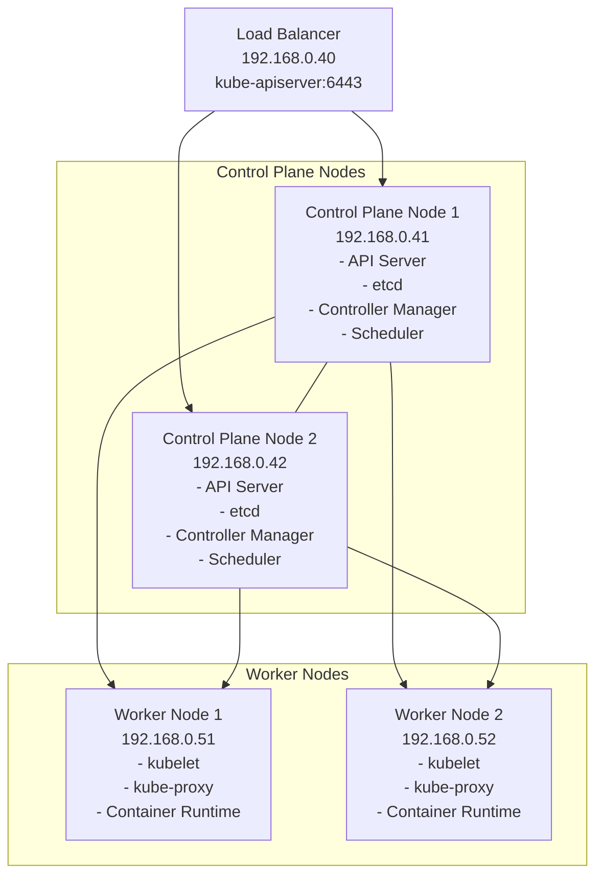

# Kubelab
HA Kubernetes running on Proxmox Virtual Environment
# Kubernetes Cluster Architecture


```mermaid
graph TD
    subgraph "Control Plane Nodes"
        CP1[Control Plane Node 1<br/>192.168.0.41<br/>- API Server<br/>- etcd<br/>- Controller Manager<br/>- Scheduler]
        CP2[Control Plane Node 2<br/>192.168.0.42<br/>- API Server<br/>- etcd<br/>- Controller Manager<br/>- Scheduler]
    end

    subgraph "Worker Nodes"
        W1[Worker Node 1<br/>192.168.0.51<br/>- kubelet<br/>- kube-proxy<br/>- Container Runtime]
        W2[Worker Node 2<br/>192.168.0.52<br/>- kubelet<br/>- kube-proxy<br/>- Container Runtime]
    end

    LB[Load Balancer<br/>192.168.0.40<br/>kube-apiserver:6443]

    LB --> CP1
    LB --> CP2
    CP1 --- CP2
    CP1 --> W1
    CP1 --> W2
    CP2 --> W1
    CP2 --> W2

```

- Prerequisites
  - [Proxmox](https://www.proxmox.com/en/products/proxmox-virtual-environment/get-started)
  - Download ubuntu cloud init image and upload to proxmox nodes - https://cloud-images.ubuntu.com/jammy/current/jammy-server-cloudimg-amd64.img
  - If your home network is not `192.168.0.0/24`, modify the configs where necessary in the following files:
    - opentofu/local.tf
    - ansible/inventory.ini
  - [Ansible](https://docs.ansible.com/)
  - [OpenTofu](https://opentofu.org/docs/intro/install/)
  - Load env variables to your system from the file vars.ymal:

  vars.yaml:
  ```yaml
  argocd_openid_client_secret: ***
  argocd_openid_issuer_url: https://<domain>/application/o/argocd/
  argocd_openid_redirect_uri: https://<domain>/api/dex/callback
  argocd_domain:
  cloudflared_hostname_1:
  cloudflared_hostname_2:
  cloudflared_hostname_3:
  cloudflared_hostname_4:
  cloudflared_hostname_5:
  db_encryption_key: 
  argocd_domain:
  authentik_secret_key:
  authentik_postgresql_password:
  s3_access_key:
  s3_secret_key:
  s3_endpoint:
  ingress_httpd_test_host:
  gitea_db_name:
  gitea_db_password:
  gitea_db_user:
  gitea_db_repmgr_password:
  gitea_admin_username:
  gitea_admin_password:
  gitea_admin_email:
  gitea_domain:
  gitea_registration_token:
  gitea_instance_url:
  ```
  ```bash
  yq eval '. as $item ireduce ({}; . *+ $item) | to_entries | .[] | "export \(.key)=\(.value)"' vars.yaml | source /dev/stdin
  ```
## Setup Infrastructure on Proxmox
dir: tofu
```
tofu init
tofu plan -out=plan
tofu apply "plan"
```
- For a detailed documentation on the infrastructure

   - 📁 [Opentofu](./opentofu/README.MD) ← Click to view
## Setup K8s
dir: ansible
```bash
ansible all -m ping
```
```bash
ansible-playbook main.yaml --tags k8s
```
###  Setup kubeconfig on bastion
```bash
ssh -i ../kubelab ubuntu@192.168.0.41 cat /home/ubuntu/.kube/config > ~/.kube/config
```

### Verify that cluster is up and running
```bash
kubectl get no
kubectl get all -A
kubectl get sc
```

# Addons
 Argocd
```bash
ansible-playbook ../addons/argocd.yaml
```
Other Applications
```bash
ansible-playbook ../addons/<application>.yaml
```
## TrueNAS NFS settings (compatible with macos)

Go to your TrueNAS web UI:

- Services → NFS → Configure the share (/mnt/pool1/k8s/nfs)
- Ensure the following settings are applied:
   - Enabled: ✔️
   - Network: 192.168.0.0/24 (or your subnet)
   - Maproot User: root (if needed for macOS compatibility)
   - Maproot Group: wheel (macOS equivalent of root group)
   - Security: sys (for compatibility)
   - Enabled NFSv4: ❌ (macOS often works better with NFSv3)

Mount commands
- Macos

```bash
mount -t nfs -o vers=3,resvport,noatime,nolocks,locallocks 192.168.0.15:/mnt/pool1/k8s/nfs ~/nfs-test
```
- Ubuntu

```bash
sudo mount 192.168.0.15:/mnt/pool1/k8s/nfs nfs-test/
```
-  Windows
  - dism /online /enable-feature /featurename:ServicesForNFS-ClientOnly /all
```powershell
mount -o nolock -o mtype=hard <NFS-Server-IP>:/<share-name> <drive-letter>:
```
```powershell
New-PSDrive -Name "Z" -PSProvider FileSystem -Root "\\<NFS-Server-IP>\<share-name>" -Persist
```
# adhoc
### Enable volume expansion
```bash
ansible-playbook main.yaml --tags adhoc,enable_volume_expansion
```
# Creating an Image Pull Secret for Docker Hub
```bash
kubectl create secret docker-registry dockerhub-secret \
  --docker-server=https://index.docker.io/v1/ \
  --docker-username=<your-dockerhub-username> \
  --docker-password=<your-dockerhub-password> \
  --docker-email=<your-email>
```
# Issues
***Error***

k8s-worker-1 | UNREACHABLE! => {
    "changed": false,
    "msg": "Failed to connect to the host via ssh: Warning: Permanently added '192.168.0.51' (ED25519) to the list of known hosts.\r\nubuntu@192.168.x.xx: Permission denied (publickey,password).",
    "unreachable": true
}

***Solution***

mv  ~/.ssh/known_hosts  ~/.ssh/known_hosts.bkp

---

***Error***

CRDs stuck in terminating state

***Solution***

kubectl get crd | grep longhorn | awk '{print $1}'
kubectl get crd | grep longhorn | awk '{print $1}' 
kubectl patch crd backuptargets.longhorn.io -p '{"metadata":{"finalizers":[]}}' --type=merge


***Error***

TASK [Wait for ArgoCD pods to be ready] *******************************************************************************************************************************************************************
An exception occurred during task execution. To see the full traceback, use -vvv. The error was: AttributeError: 'NoneType' object has no attribute 'status'
fatal: [k8s-control-plane-1]: FAILED! => {"changed": false, "module_stderr": "Shared connection to 192.168.0.41 closed.\r\n", "module_stdout": "Traceback (most recent call last):\r\n

--- omitted --

 File \"/tmp/ansible_kubernetes.core.k8s_info_payload_a2wp4_ji/ansible_kubernetes.core.k8s_info_payload.zip/ansible_collections/kubernetes/core/plugins/module_utils/k8s/waiter.py\", line 86, in custom_condition\r\nAttributeError: 'NoneType' object has no attribute 'status'\r\n", "msg": "MODULE FAILURE: No start of json char found\nSee stdout/stderr for the exact error", "rc": 1}

***Solution***

Try deploying again.
