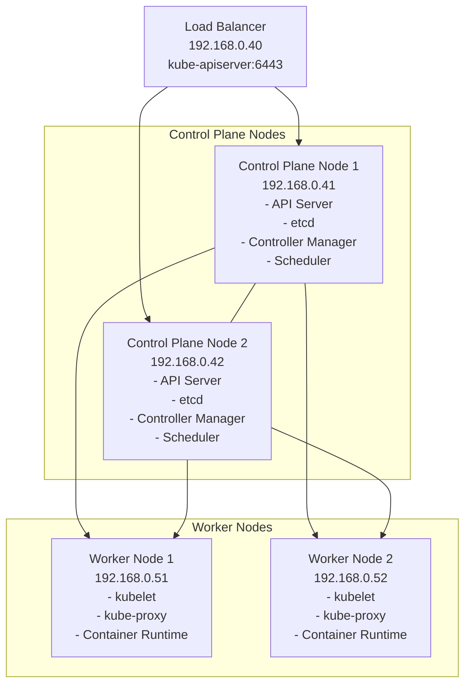

# Kubelab

A production-ready Kubernetes cluster running on Proxmox Virtual Environment with GitOps-based application deployment.

## Overview

Kubelab provides a complete solution for deploying and managing a high-availability Kubernetes cluster with:

- Automated infrastructure provisioning using OpenTofu
- Kubernetes cluster setup and configuration with Ansible
- GitOps-based application deployment using ArgoCD
- Comprehensive monitoring and observability stack
- Integrated authentication and identity management

## Architecture


```mermaid
graph TD
    subgraph "Control Plane Nodes"
        CP1[Control Plane Node 1<br/>192.168.0.41<br/>- API Server<br/>- etcd<br/>- Controller Manager<br/>- Scheduler]
        CP2[Control Plane Node 2<br/>192.168.0.42<br/>- API Server<br/>- etcd<br/>- Controller Manager<br/>- Scheduler]
    end

    subgraph "Worker Nodes"
        W1[Worker Node 1<br/>192.168.0.51<br/>- kubelet<br/>- kube-proxy<br/>- Container Runtime]
        W2[Worker Node 2<br/>192.168.0.52<br/>- kubelet<br/>- kube-proxy<br/>- Container Runtime]
    end

    LB[Load Balancer<br/>192.168.0.40<br/>kube-apiserver:6443]

    LB --> CP1
    LB --> CP2
    CP1 --- CP2
    CP1 --> W1
    CP1 --> W2
    CP2 --> W1
    CP2 --> W2
```

## Quick Start

### Prerequisites

- [Proxmox Virtual Environment](https://www.proxmox.com/en/products/proxmox-virtual-environment/get-started)
- [OpenTofu](https://opentofu.org/docs/intro/install/) for infrastructure provisioning
- [Ansible](https://docs.ansible.com/) for configuration management
- Ubuntu cloud image: [jammy-server-cloudimg-amd64.img](https://cloud-images.ubuntu.com/jammy/current/)

### 1. Configure Environment Variables

Create a `vars.yaml` file with your configuration values and load them:

```bash
yq eval '. as $item ireduce ({}; . *+ $item) | to_entries | .[] | "export \(.key)=\(.value)"' vars.yaml | source /dev/stdin
```

### 2. Provision Infrastructure

```bash
cd tofu
tofu init
tofu plan -out=plan
tofu apply "plan"
```

### 3. Deploy Kubernetes

```bash
cd ../ansible
ansible all -m ping
ansible-playbook main.yaml --tags k8s
```

### 4. Configure Local Access

```bash
ssh -i ../kubelab ubuntu@192.168.0.41 cat /home/ubuntu/.kube/config > ~/.kube/config
kubectl get nodes
```

### 5. Deploy Applications

```bash
# Deploy ArgoCD
ansible-playbook ../addons/argocd.yaml

# Deploy other applications
ansible-playbook ../addons/<application>.yaml
```

## Directory Structure

- `/addons` - ArgoCD application manifests
- `/ansible` - Ansible playbooks for cluster setup
- `/helm` - Helm values for applications
- `/kustomize` - Kustomize overlays for applications
- `/tofu` - OpenTofu configurations for infrastructure
- `/docs` - Additional documentation

## Storage Configuration

The cluster is configured to use TrueNAS NFS storage. See [Storage Documentation](./k8s-storage/README.MD) for details.

## Upgrading Kubernetes

For upgrade instructions, see [Kubernetes Upgrade Guide](./upgrade_k8s.md).

## Troubleshooting

Common issues and their solutions are documented in the [Troubleshooting Guide](./docs/troubleshooting.md).

## Contributing

Contributions are welcome! Please feel free to submit a Pull Request.
