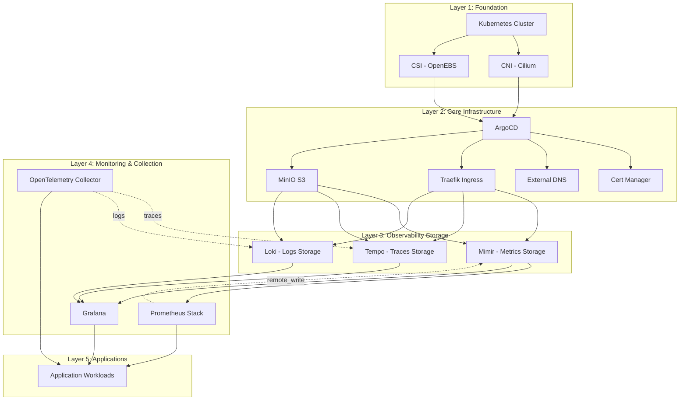
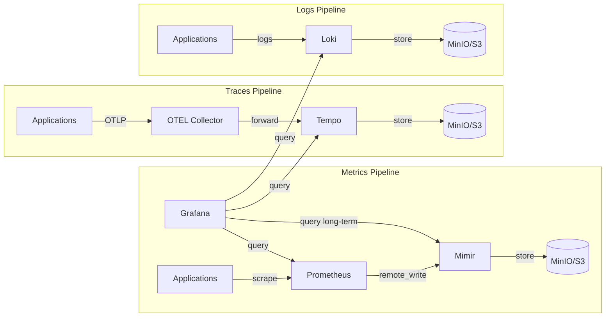

# Kubelab Architecture & Deployment Guide

## Table of Contents
- [Architecture Overview](#architecture-overview)
- [Data Flow](#data-flow)
- [Deployment Order](#deployment-order)
- [Component Dependencies](#component-dependencies)
- [Configuration](#configuration)
- [Deployment Commands](#deployment-commands)
- [Troubleshooting](#troubleshooting)

---

## Architecture Overview



---

## Data Flow



### Network Flow

```
Internet
    ↓
Traefik Ingress (LoadBalancer)
    ↓
┌─────────────────────────────────────┐
│  Internal Services                  │
│  - grafana.local.example.com       │
│  - prometheus.local.example.com    │
│  - argocd.local.example.com        │
└─────────────────────────────────────┘
    ↓
Pod Network (Cilium CNI)
    ↓
Persistent Storage (OpenEBS)
```

---

## Deployment Order

### Phase 1: Foundation (Required First)
1. **Kubernetes Cluster** - Container orchestration platform
2. **CNI (Cilium)** - Network connectivity & security
3. **CSI (OpenEBS)** - Persistent storage

### Phase 2: Core Infrastructure
4. **ArgoCD** - GitOps controller for automated deployments
5. **Cert Manager** - TLS certificate management
6. **External DNS** - Automatic DNS record creation
7. **Traefik** - Ingress controller for routing
8. **MinIO** - S3-compatible object storage

### Phase 3: Observability Backend
9. **Mimir** - Long-term metrics storage
   - Requires: MinIO buckets (mimir-blocks, mimir-alertmanager, mimir-ruler)
10. **Tempo** - Distributed traces storage
11. **Loki** - Log aggregation storage

### Phase 4: Monitoring & Visualization
12. **Prometheus Stack** - Metrics collection & alerting
    - Configured with remote_write to Mimir
13. **OpenTelemetry Collector** - Traces/logs collection
14. **Grafana** - Unified observability dashboard
    - Datasources: Prometheus, Mimir, Tempo, Loki

### Phase 5: Applications
15. **Application Workloads**
    - Instrumented with metrics endpoints
    - OTLP traces to OpenTelemetry

---

## Component Dependencies

| Component | Depends On | Provides To | Purpose |
|-----------|-----------|-------------|---------|
| **Kubernetes** | - | All | Container orchestration |
| **Cilium** | Kubernetes | All pods | Network connectivity & security |
| **OpenEBS** | Kubernetes | StatefulSets | Persistent storage |
| **ArgoCD** | K8s, CNI, CSI | All apps | GitOps deployment |
| **Cert Manager** | ArgoCD | Ingresses | TLS certificate management |
| **External DNS** | ArgoCD | Ingresses | Automatic DNS records |
| **Traefik** | ArgoCD, Cert Manager | Services | Ingress routing |
| **MinIO** | ArgoCD, OpenEBS | Mimir, Tempo, Loki | S3-compatible object storage |
| **Mimir** | MinIO, Traefik | Prometheus, Grafana | Long-term metrics storage |
| **Tempo** | MinIO, Traefik | OTEL, Grafana | Distributed tracing backend |
| **Loki** | MinIO, Traefik | Apps, Grafana | Log aggregation |
| **Prometheus** | Mimir | Grafana, Apps | Metrics collection & alerting |
| **OTEL Collector** | Tempo | Apps | Traces/logs collection |
| **Grafana** | Prometheus, Mimir, Tempo, Loki | Users | Unified observability UI |

---

## Configuration

### Prometheus → Mimir Integration

```yaml
remoteWrite:
  - url: http://mimir-nginx.mimir.svc:80/api/v1/push
    headers:
      X-Scope-OrgID: kube-prometheus-stack
```

### Grafana Datasources

```yaml
datasources:
  - name: Prometheus
    url: http://kube-prometheus-stack-prometheus.kube-prometheus-stack.svc:9090
  
  - name: Mimir
    url: http://mimir-nginx.mimir.svc.cluster.local:80/prometheus
  
  - name: Tempo
    url: http://tempo-gateway.grafana-system.svc.cluster.local
  
  - name: Loki
    url: http://loki-stack.monitoring.svc:3100
```

### MinIO Buckets

Required buckets for observability stack:

```
mimir-blocks          # Mimir metrics blocks
mimir-alertmanager    # Mimir alertmanager state
mimir-ruler           # Mimir ruler state
thanos-store          # Prometheus long-term storage
tempo-traces          # Tempo traces
loki-chunks           # Loki log chunks
```

### ⚠️ Mimir S3 Configuration

**Important**: Mimir requires separate S3 buckets for each storage component. Using the same bucket name without different storage prefixes will cause validation errors:

```
error validating config: invalid bucket config: alertmanager storage: 
S3 bucket name and storage prefix cannot be the same as the one used in blocks storage config
```

**Correct configuration** in `helm/mimir_values.yaml`:

```yaml
mimir:
  structuredConfig:
    blocks_storage:
      s3:
        bucket_name: mimir-blocks
    
    alertmanager_storage:
      s3:
        bucket_name: mimir-alertmanager
    
    ruler_storage:
      s3:
        bucket_name: mimir-ruler
```

---

## Deployment Commands

### Phase 1: Foundation
```bash
# Deploy Kubernetes cluster (manual or via kubeadm/k3s/etc)
# CNI and CSI are typically deployed during cluster initialization
```

### Phase 2: Core Infrastructure
```bash
ansible-playbook main.yaml --tags argocd
ansible-playbook main.yaml --tags cert-manager
ansible-playbook main.yaml --tags external-dns
ansible-playbook main.yaml --tags traefik
ansible-playbook main.yaml --tags minio
```

### Phase 3: Observability Backend
```bash
# Create MinIO buckets first
ansible-playbook fix-mimir-buckets.yaml

# Deploy observability storage
ansible-playbook addons/mimir.yaml
ansible-playbook addons/tempo.yaml
ansible-playbook addons/loki.yaml
```

### Phase 4: Monitoring & Visualization
```bash
ansible-playbook addons/kube-prometheus-stack.yaml
ansible-playbook addons/otel-collector.yaml
ansible-playbook addons/grafana.yaml
```

### Phase 5: Applications
```bash
ansible-playbook addons/your-app.yaml
```

### Verification Commands
```bash
# Check all pods are running
kubectl get pods -A

# Verify ArgoCD applications
kubectl get applications -n argocd

# Check Mimir health
kubectl get pods -n mimir
kubectl logs -n mimir -l app.kubernetes.io/name=mimir --tail=50

# Verify MinIO buckets
kubectl exec -n minio deploy/minio -- mc ls minio/
```

---

## Troubleshooting

### Common Issues

#### Mimir pods failing with bucket errors
**Symptoms**: Pods crash with "invalid bucket config" error

**Solution**:
- Ensure separate buckets are created for blocks, alertmanager, and ruler
- Verify bucket names in `helm/mimir_values.yaml` match created buckets
- Restart affected pods after configuration changes:
  ```bash
  kubectl delete pod -n mimir -l app.kubernetes.io/name=mimir
  ```

#### ArgoCD sync failures
**Symptoms**: Applications stuck in "OutOfSync" or "Degraded" state

**Solution**:
```bash
# Check application status
kubectl get application -n argocd

# View sync errors
kubectl describe application <app-name> -n argocd

# Force sync
kubectl patch application <app-name> -n argocd --type merge -p '{"operation":{"initiatedBy":{"username":"admin"},"sync":{}}}'
```

#### Certificate issues
**Symptoms**: TLS certificate not issued or expired

**Solution**:
```bash
# Verify cert-manager is running
kubectl get pods -n cert-manager

# Check certificate status
kubectl get certificates -A

# Describe certificate for details
kubectl describe certificate <cert-name> -n <namespace>

# Check cert-manager logs
kubectl logs -n cert-manager -l app=cert-manager
```

#### DNS resolution problems
**Symptoms**: Services not accessible via domain names

**Solution**:
```bash
# Verify external-dns is running
kubectl get pods -n external-dns

# Check DNS records being managed
kubectl logs -n external-dns -l app.kubernetes.io/name=external-dns

# Verify ingress has correct annotations
kubectl get ingress -A -o yaml | grep -A 5 "external-dns"
```

#### Pod stuck in Pending state
**Symptoms**: Pods not scheduling

**Solution**:
```bash
# Check pod events
kubectl describe pod <pod-name> -n <namespace>

# Check node resources
kubectl top nodes

# Check PVC status if using persistent storage
kubectl get pvc -A
```

For more troubleshooting tips, see [Troubleshooting Guide](troubleshooting.md).
