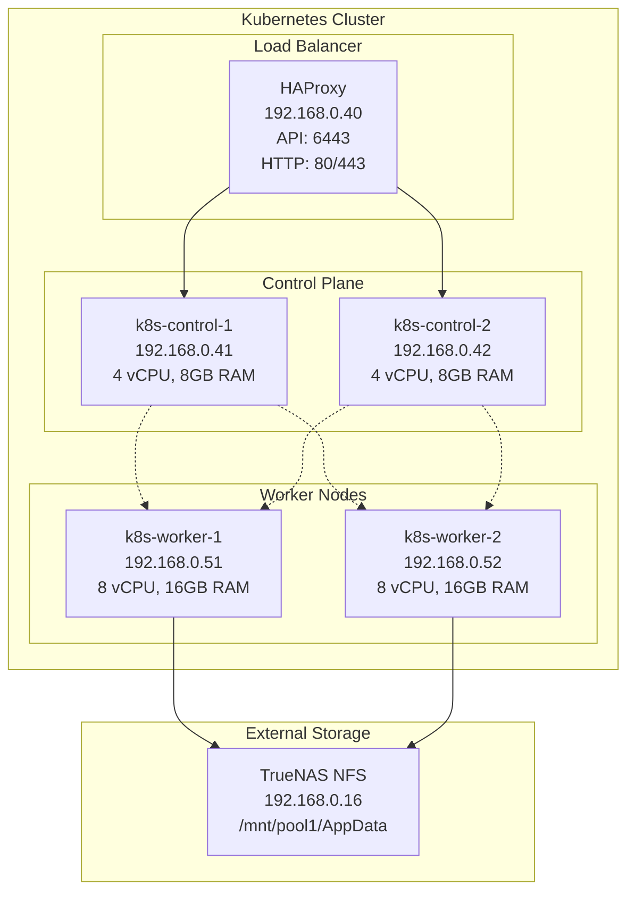
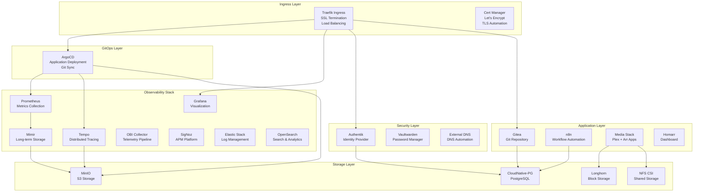
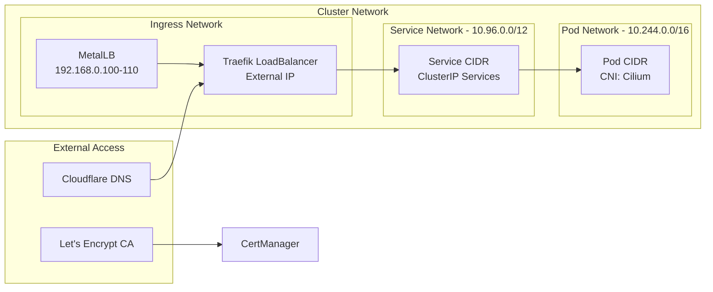
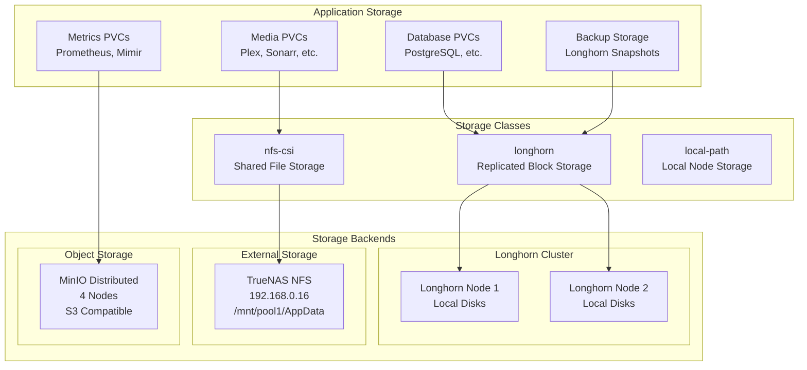
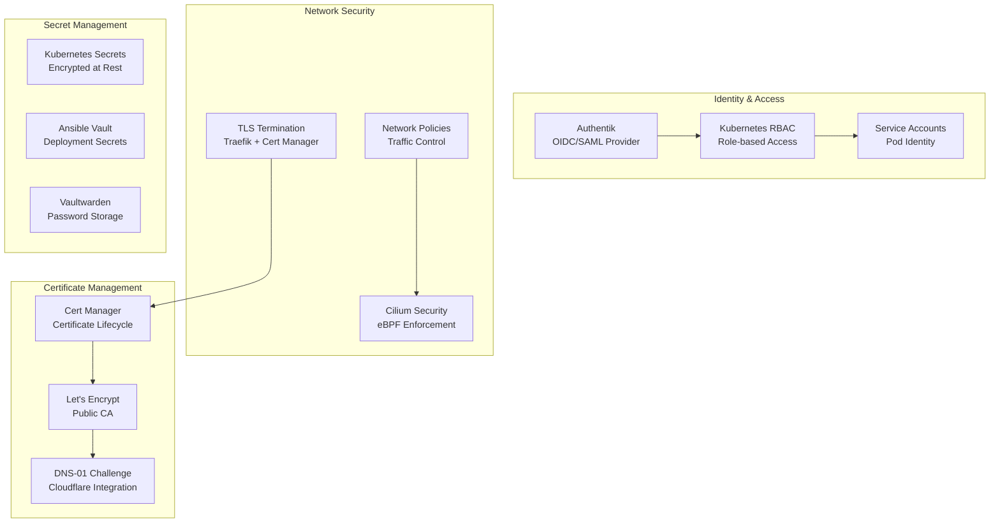
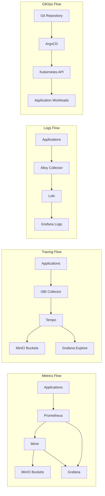
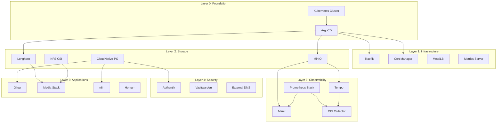
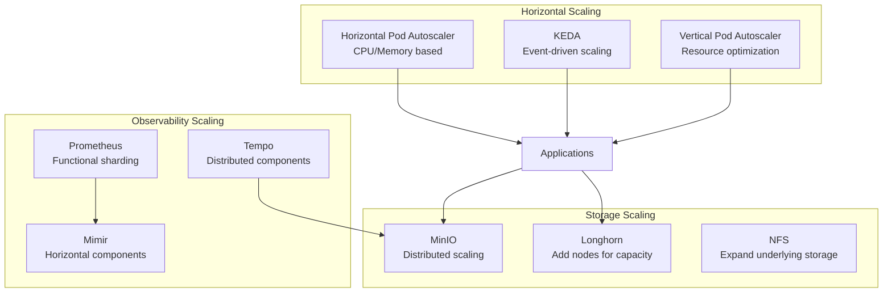

# KubeLab Architecture

## 🏗️ Cluster Infrastructure

## 📦 Application Layer Architecture

## 🌐 Network Architecture

## 💾 Storage Architecture

## 🔐 Security Architecture

## 📊 Data Flow Architecture

## 🔧 Addon Dependencies

## 📈 Scaling Architecture

---

**🏗️ Architecture Summary:** Production-ready Kubernetes cluster with layered addon architecture, comprehensive observability, and enterprise-grade security and storage solutions.
