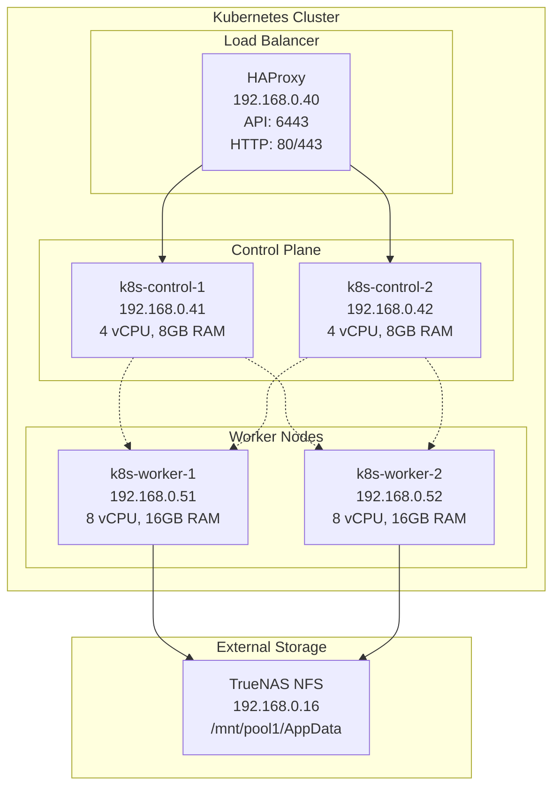
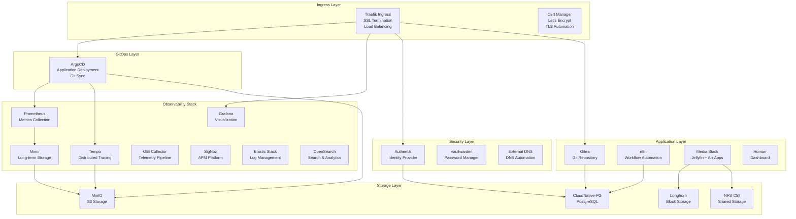
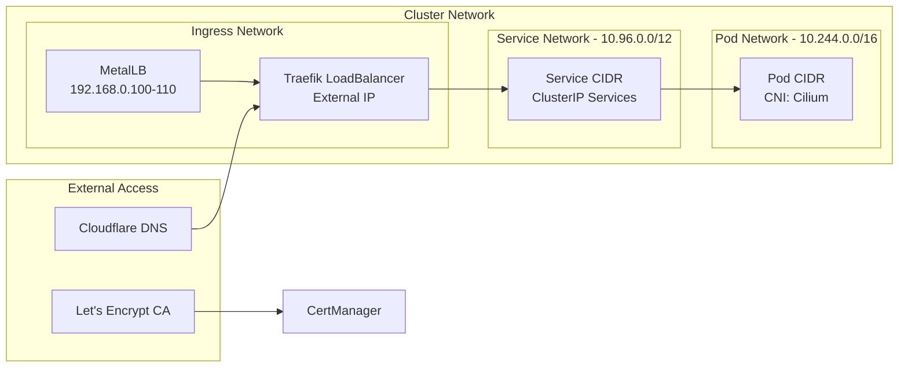
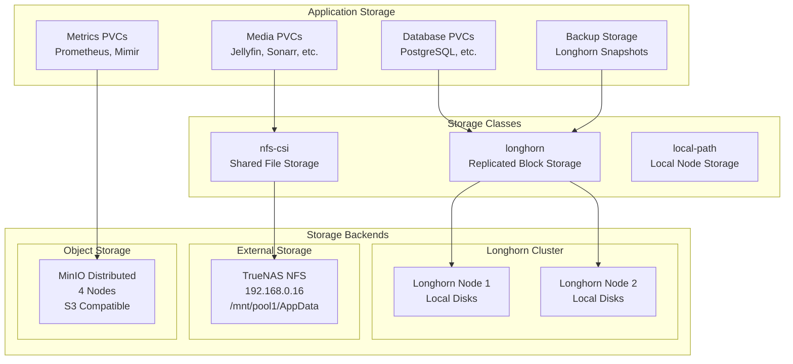
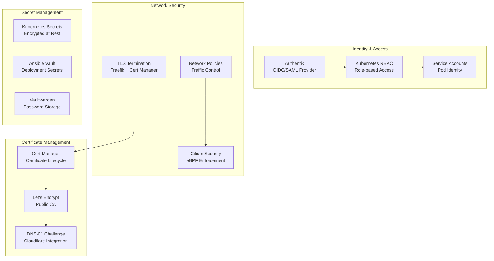
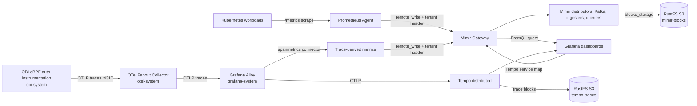
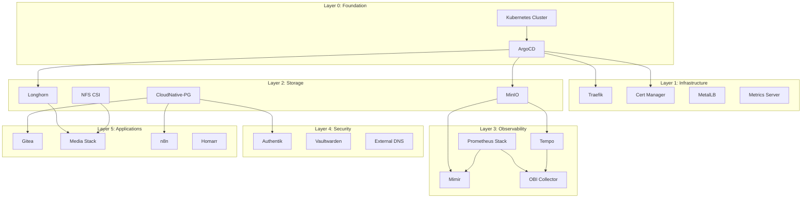
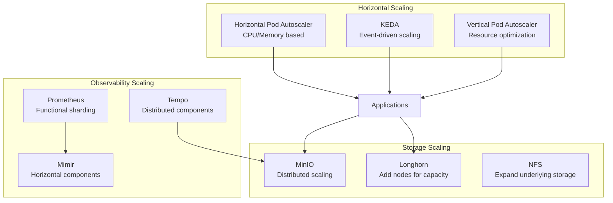

# KubeLab Architecture

## 🏗️ Cluster Infrastructure

```mermaid
graph TB
    subgraph "External Storage"
        TrueNAS[TrueNAS NFS<br/>192.168.0.16<br/>/mnt/pool1/AppData]
    end

    subgraph "Kubernetes Cluster"
        subgraph "Load Balancer"
            LB[HAProxy<br/>192.168.0.40<br/>API: 6443<br/>HTTP: 80/443]
        end

        subgraph "Control Plane"
            CP1[k8s-control-1<br/>192.168.0.41<br/>4 vCPU, 8GB RAM]
            CP2[k8s-control-2<br/>192.168.0.42<br/>4 vCPU, 8GB RAM]
        end

        subgraph "Worker Nodes"
            W1[k8s-worker-1<br/>192.168.0.51<br/>8 vCPU, 16GB RAM]
            W2[k8s-worker-2<br/>192.168.0.52<br/>8 vCPU, 16GB RAM]
        end
    end

    LB --> CP1
    LB --> CP2
    CP1 -.-> W1
    CP1 -.-> W2
    CP2 -.-> W1
    CP2 -.-> W2
    W1 --> TrueNAS
    W2 --> TrueNAS
```

## 📦 Application Layer Architecture

```mermaid
graph TB
    subgraph "Ingress Layer"
        Traefik[Traefik Ingress<br/>SSL Termination<br/>Load Balancing]
        CertManager[Cert Manager<br/>Let's Encrypt<br/>TLS Automation]
    end

    subgraph "GitOps Layer"
        ArgoCD[ArgoCD<br/>Application Deployment<br/>Git Sync]
    end

    subgraph "Observability Stack"
        Prometheus[Prometheus<br/>Metrics Collection]
        Grafana[Grafana<br/>Visualization]
        Mimir[Mimir<br/>Long-term Storage]
        Tempo[Tempo<br/>Distributed Tracing]
        OBI[OBI Collector<br/>Telemetry Pipeline]
        SigNoz[SigNoz<br/>APM Platform]
        Elastic[Elastic Stack<br/>Log Management]
        OpenSearch[OpenSearch<br/>Search & Analytics]
    end

    subgraph "Storage Layer"
        MinIO[MinIO<br/>S3 Storage]
        Longhorn[Longhorn<br/>Block Storage]
        CNPG[CloudNative-PG<br/>PostgreSQL]
        NFS[NFS CSI<br/>Shared Storage]
    end

    subgraph "Security Layer"
        Authentik[Authentik<br/>Identity Provider]
        Vaultwarden[Vaultwarden<br/>Password Manager]
        ExternalDNS[External DNS<br/>DNS Automation]
    end

    subgraph "Application Layer"
        Gitea[Gitea<br/>Git Repository]
        N8N[n8n<br/>Workflow Automation]
        MediaStack[Media Stack<br/>Jellyfin + Arr Apps]
        Homarr[Homarr<br/>Dashboard]
    end

    Traefik --> ArgoCD
    Traefik --> Grafana
    Traefik --> Authentik
    Traefik --> Gitea
    
    ArgoCD --> Prometheus
    ArgoCD --> Tempo
    ArgoCD --> MinIO
    
    Prometheus --> Mimir
    Tempo --> MinIO
    Mimir --> MinIO
    
    Authentik --> CNPG
    Gitea --> CNPG
    N8N --> CNPG
    
    MediaStack --> Longhorn
    MediaStack --> NFS
```

## 🌐 Network Architecture

```mermaid
graph LR
    subgraph "External Access"
        CF[Cloudflare DNS]
        LE[Let's Encrypt CA]
    end

    subgraph "Cluster Network"
        subgraph "Pod Network - 10.244.0.0/16"
            PodCIDR[Pod CIDR<br/>CNI: Cilium]
        end
        
        subgraph "Service Network - 10.96.0.0/12"
            SvcCIDR[Service CIDR<br/>ClusterIP Services]
        end
        
        subgraph "Ingress Network"
            MetalLB[MetalLB<br/>192.168.0.100-110]
            TraefikLB[Traefik LoadBalancer<br/>External IP]
        end
    end

    CF --> TraefikLB
    LE --> CertManager
    TraefikLB --> SvcCIDR
    SvcCIDR --> PodCIDR
    MetalLB --> TraefikLB
```

## 💾 Storage Architecture

```mermaid
graph TB
    subgraph "Storage Classes"
        SC1[longhorn<br/>Replicated Block Storage]
        SC2[nfs-csi<br/>Shared File Storage]
        SC3[local-path<br/>Local Node Storage]
    end

    subgraph "Storage Backends"
        subgraph "Longhorn Cluster"
            LH1[Longhorn Node 1<br/>Local Disks]
            LH2[Longhorn Node 2<br/>Local Disks]
        end
        
        subgraph "External Storage"
            NFS_Server[TrueNAS NFS<br/>192.168.0.16<br/>/mnt/pool1/AppData]
        end
        
        subgraph "Object Storage"
            MinIO_Cluster[MinIO Distributed<br/>4 Nodes<br/>S3 Compatible]
        end
    end

    subgraph "Application Storage"
        DB_Storage[Database PVCs<br/>PostgreSQL, etc.]
        Media_Storage[Media PVCs<br/>Jellyfin, Sonarr, etc.]
        Metrics_Storage[Metrics PVCs<br/>Prometheus, Mimir]
        Backup_Storage[Backup Storage<br/>Longhorn Snapshots]
    end

    SC1 --> LH1
    SC1 --> LH2
    SC2 --> NFS_Server
    
    DB_Storage --> SC1
    Media_Storage --> SC2
    Metrics_Storage --> MinIO_Cluster
    Backup_Storage --> SC1
```

## 🔐 Security Architecture

```mermaid
graph TB
    subgraph "Identity & Access"
        Authentik_IDP[Authentik<br/>OIDC/SAML Provider]
        RBAC[Kubernetes RBAC<br/>Role-based Access]
        ServiceAccounts[Service Accounts<br/>Pod Identity]
    end

    subgraph "Network Security"
        NetworkPolicies[Network Policies<br/>Traffic Control]
        Cilium_Security[Cilium Security<br/>eBPF Enforcement]
        TLS_Termination[TLS Termination<br/>Traefik + Cert Manager]
    end

    subgraph "Secret Management"
        K8s_Secrets[Kubernetes Secrets<br/>Encrypted at Rest]
        Ansible_Vault[Ansible Vault<br/>Deployment Secrets]
        Vaultwarden_Vault[Vaultwarden<br/>Password Storage]
    end

    subgraph "Certificate Management"
        CertManager_CA[Cert Manager<br/>Certificate Lifecycle]
        LetsEncrypt[Let's Encrypt<br/>Public CA]
        DNS_Challenge[DNS-01 Challenge<br/>Cloudflare Integration]
    end

    Authentik_IDP --> RBAC
    RBAC --> ServiceAccounts
    NetworkPolicies --> Cilium_Security
    TLS_Termination --> CertManager_CA
    CertManager_CA --> LetsEncrypt
    LetsEncrypt --> DNS_Challenge
```

## 📊 Data Flow Architecture

```mermaid
flowchart LR
    Apps[Kubernetes workloads] -->|/metrics scrape| Prometheus[Prometheus Agent]
    Prometheus -->|remote_write + tenant header| MimirGW[Mimir Gateway]
    MimirGW --> Mimir[Mimir distributors, Kafka, ingesters, queriers]
    Mimir -->|blocks_storage| S3[(RustFS S3<br/>mimir-blocks)]
    MimirGW -->|PromQL query| Grafana[Grafana dashboards]

    OBI[OBI eBPF auto-instrumentation<br/>obi-system] -->|OTLP traces :4317| Fanout[OTel Fanout Collector<br/>otel-system]
    Fanout -->|OTLP traces| Alloy[Grafana Alloy<br/>grafana-system]
    Alloy -->|OTLP| Tempo[Tempo distributed]
    Tempo -->|trace blocks| S3T[(RustFS S3<br/>tempo-traces)]
    Tempo --> Grafana
    Alloy -->|spanmetrics connector| Derived[Trace-derived metrics]
    Derived -->|remote_write + tenant header| MimirGW
    Grafana -->|Tempo service map| MimirGW
```

Detailed observability flow, dependencies, tenant configuration, and verification steps are documented in [observability-data-flow.md](observability-data-flow.md).

## 🔧 Addon Dependencies

```mermaid
graph TD
    subgraph "Layer 0: Foundation"
        K8s[Kubernetes Cluster]
        ArgoCD[ArgoCD]
    end

    subgraph "Layer 1: Infrastructure"
        Traefik[Traefik]
        CertManager[Cert Manager]
        MetalLB[MetalLB]
        MetricsServer[Metrics Server]
    end

    subgraph "Layer 2: Storage"
        MinIO[MinIO]
        Longhorn[Longhorn]
        CNPG[CloudNative-PG]
        NFS_CSI[NFS CSI]
    end

    subgraph "Layer 3: Observability"
        Prometheus[Prometheus Stack]
        Mimir[Mimir]
        Tempo[Tempo]
        OBI[OBI Collector]
    end

    subgraph "Layer 4: Security"
        Authentik[Authentik]
        Vaultwarden[Vaultwarden]
        ExternalDNS[External DNS]
    end

    subgraph "Layer 5: Applications"
        Gitea[Gitea]
        MediaStack[Media Stack]
        N8N[n8n]
        Homarr[Homarr]
    end

    K8s --> ArgoCD
    ArgoCD --> Traefik
    ArgoCD --> CertManager
    ArgoCD --> MinIO
    ArgoCD --> Longhorn
    
    MinIO --> Mimir
    MinIO --> Tempo
    Prometheus --> Mimir
    Prometheus --> OBI
    Tempo --> OBI
    
    CNPG --> Authentik
    CNPG --> Gitea
    CNPG --> N8N
    
    Longhorn --> MediaStack
    NFS_CSI --> MediaStack
```

## 📈 Scaling Architecture

```mermaid
graph TB
    subgraph "Horizontal Scaling"
        HPA[Horizontal Pod Autoscaler<br/>CPU/Memory based]
        KEDA[KEDA<br/>Event-driven scaling]
        VPA[Vertical Pod Autoscaler<br/>Resource optimization]
    end

    subgraph "Storage Scaling"
        Longhorn_Replicas[Longhorn<br/>Add nodes for capacity]
        MinIO_Distributed[MinIO<br/>Distributed scaling]
        NFS_Expansion[NFS<br/>Expand underlying storage]
    end

    subgraph "Observability Scaling"
        Prometheus_Sharding[Prometheus<br/>Functional sharding]
        Mimir_Scaling[Mimir<br/>Horizontal components]
        Tempo_Scaling[Tempo<br/>Distributed components]
    end

    HPA --> Applications
    KEDA --> Applications
    VPA --> Applications
    
    Applications --> Longhorn_Replicas
    Applications --> MinIO_Distributed
    
    Prometheus_Sharding --> Mimir_Scaling
    Tempo_Scaling --> MinIO_Distributed
```

---

**🏗️ Architecture Summary:** Production-ready Kubernetes cluster with layered addon architecture, comprehensive observability, and enterprise-grade security and storage solutions.
