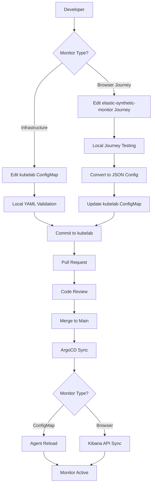

# GitOps Approach to Elastic Synthetic Monitoring

## Overview

This document outlines the implementation of a GitOps-based approach to managing Elastic synthetic monitors, leveraging the existing infrastructure setup with Fleet Server, private locations, and ArgoCD for continuous deployment.

## Architecture

### Current Infrastructure
- **Fleet Server**: Deployed in Kubernetes (`fleet-server-policy-default`)
- **Private Location**: `synthetic-monitor-default` linked to `synthetic-monitor-policy-default`
- **Synthetic Monitor Agent**: Deployed via ArgoCD from `kustomize/elastic-synthetic-monitor/overlays/prod`
- **ArgoCD**: Managing application deployments with automated sync

### GitOps Flow
```
Developer → Git Repository → ArgoCD → Kubernetes → Elastic Agent → Kibana
    ↓           ↓              ↓           ↓            ↓          ↓
  Monitor    Version       Auto-Sync   ConfigMap   Monitor     Dashboard
   Config    Control      Detection    Update      Execution   & Alerts
```

## Repository Structure

### Primary Repositories

```
kubelab/                                      # Infrastructure and GitOps
├── kustomize/elastic-synthetic-monitor/
│   ├── base/
│   │   ├── elastic-synthetic-monitor.yaml    # Base agent deployment
│   │   └── kustomization.yaml
│   └── overlays/
│       └── prod/
│           ├── kustomization.yaml
│           ├── icmp-monitors.yaml            # ICMP monitor definitions
│           ├── http-monitors.yaml            # HTTP monitor definitions
│           ├── browser-monitors.yaml         # Browser monitor definitions
│           └── tcp-monitors.yaml             # TCP monitor definitions
└── addons/
    └── elastic-synthetic-monitor.yaml        # Infrastructure setup (Ansible)

elastic-synthetic-monitor/                    # Synthetics development
├── journeys/                                 # Browser journey definitions
│   ├── example.journey.ts                   # Example browser monitor
│   ├── advanced-example.journey.ts          # Advanced browser scenarios
│   └── advanced-example-helpers.ts          # Helper functions
├── lightweight/                              # Lightweight monitor configs
│   └── heartbeat.yml                        # Heartbeat configuration
├── k8s/                                      # Kubernetes manifests (new)
│   ├── namespace.yaml                       # Synthetic monitoring namespace
│   ├── configmaps/                          # Monitor configurations
│   │   ├── icmp-monitors.yaml
│   │   ├── http-monitors.yaml
│   │   ├── browser-monitors.yaml
│   │   └── tcp-monitors.yaml
│   └── sync/                                # GitOps sync components
│       ├── cronjob.yaml                     # Kibana API sync job
│       └── configmap-watcher.yaml           # Configuration change watcher
├── synthetics.config.ts                     # Synthetics configuration
├── package.json                             # Node.js dependencies
└── README.md                                # Project documentation
```

## Implementation Strategy

### Hybrid GitOps Approach

Based on the existing `elastic-synthetic-monitor` repository structure, we'll implement a hybrid approach that combines:

1. **ConfigMap-Based Configuration**: For infrastructure and lightweight monitors
2. **Kibana API Integration**: For browser journeys and complex monitors
3. **Dual Repository Strategy**: Separate concerns between infrastructure and monitor development

#### Repository Integration Flow
```
elastic-synthetic-monitor (Development)     kubelab (Infrastructure)
         ↓                                         ↓
    Journey Development                    ConfigMap Definitions
         ↓                                         ↓
    Local Testing                          Kustomize Overlays
         ↓                                         ↓
    Git Commit                             ArgoCD Sync
         ↓                                         ↓
    CI/CD Pipeline                         Kubernetes Deployment
         ↓                                         ↓
    Kibana API Push                        Agent Configuration
         ↓                                         ↓
         Monitor Execution in Elastic Stack
```

### 1. Monitor Configuration as Code

**ConfigMap-Based Approach:**
- Each monitor type gets its own ConfigMap
- Monitors defined in YAML format within ConfigMaps
- ConfigMaps mounted as volumes in the Elastic Agent deployment
- Agent automatically picks up configuration changes

**Benefits:**
- Version controlled monitor configurations
- Environment-specific overrides via Kustomize
- Atomic deployments of monitor changes
- Easy rollback capabilities

### 2. Monitor Types and Examples

#### ICMP Monitor
```yaml
apiVersion: v1
kind: ConfigMap
metadata:
  name: icmp-monitors
  labels:
    managed-by: gitops
    component: synthetic-monitor
data:
  k8s-worker-1-icmp.yml: |
    name: "k8s-worker-1 ICMP Health"
    type: icmp
    schedule: "@every 30s"
    hosts: ["192.168.0.51"]
    locations: ["synthetic-monitor-default"]
    timeout: 10s
    wait: 1s
    tags: 
      - "gitops-managed"
      - "infrastructure"
      - "icmp"
      - "k8s-worker-1"
    fields:
      monitor:
        name: "k8s-worker-1 ICMP Health"
        type: "icmp"
      observer:
        geo:
          name: "synthetic-monitor-default"
    processors:
      - add_fields:
          target: labels
          fields:
            environment: production
            team: infrastructure
            managed_by: gitops
```

#### HTTP Monitor
```yaml
apiVersion: v1
kind: ConfigMap
metadata:
  name: http-monitors
  labels:
    managed-by: gitops
    component: synthetic-monitor
data:
  api-health.yml: |
    name: "API Health Check"
    type: http
    schedule: "@every 1m"
    urls: ["https://api.example.com/health"]
    locations: ["synthetic-monitor-default"]
    method: GET
    timeout: 30s
    tags: 
      - "gitops-managed"
      - "api"
      - "health"
    check:
      response:
        status: [200]
        body:
          positive: ["status.*ok", "healthy"]
    processors:
      - add_fields:
          target: labels
          fields:
            environment: production
            service: api
            managed_by: gitops
```

#### Browser Monitor (Kibana API Integration)
```yaml
# Browser monitors use the existing journey structure from elastic-synthetic-monitor repo
# These are managed via Kibana API rather than ConfigMaps for better UI integration

# Example: Converting existing journey to GitOps
# From: journeys/example.journey.ts
apiVersion: v1
kind: ConfigMap
metadata:
  name: browser-journey-configs
  labels:
    managed-by: gitops
    component: synthetic-monitor
    monitor-type: browser
data:
  example-journey.json: |
    {
      "name": "My Example Journey",
      "id": "example-monitor",
      "type": "browser",
      "schedule": {
        "number": "10",
        "unit": "m"
      },
      "locations": ["synthetic-monitor-default"],
      "source": {
        "inline": {
          "script": "step('launch application', async () => { await page.goto(params.url); }); step('assert title', async () => { const header = await page.locator('h1'); expect(await header.textContent()).toBe('todos'); });"
        }
      },
      "params": {
        "url": "https://elastic.github.io/synthetics-demo/"
      },
      "tags": ["gitops-managed", "user-journey", "example"],
      "enabled": true
    }

  # Sync job configuration for Kibana API
  sync-config.yaml: |
    kibana:
      url: "https://kibana.local.jazziro.com"
      space: "default"
      auth:
        type: "basic"
        username: "elastic"
        password_secret: "kibana-credentials"
    sync:
      interval: "30s"
      dry_run: false
      delete_orphaned: true
    monitors:
      source_path: "/config/browser-journeys"
      api_endpoint: "/api/synthetics/monitors"
      project_id: "elastic-synthetic-monitor"
```

#### TCP Monitor
```yaml
apiVersion: v1
kind: ConfigMap
metadata:
  name: tcp-monitors
  labels:
    managed-by: gitops
    component: synthetic-monitor
data:
  database-connection.yml: |
    name: "Database Connection Check"
    type: tcp
    schedule: "@every 2m"
    hosts: ["db.example.com:5432"]
    locations: ["synthetic-monitor-default"]
    timeout: 10s
    tags: 
      - "gitops-managed"
      - "database"
      - "tcp"
    processors:
      - add_fields:
          target: labels
          fields:
            environment: production
            service: database
            managed_by: gitops
```

### 3. Deployment Architecture

#### Hybrid Deployment Strategy

The deployment architecture supports both ConfigMap-based monitors (ICMP, HTTP, TCP) and Kibana API-based monitors (Browser journeys):

```yaml
# Enhanced deployment with dual configuration support
apiVersion: apps/v1
kind: Deployment
metadata:
  name: elastic-synthetic-monitor
  namespace: synthetic-monitoring
  labels:
    managed-by: ansible
    component: synthetic-monitor
    app: elastic-stack
spec:
  template:
    spec:
      containers:
        # Main Elastic Agent container
        - name: elastic-synthetic-monitor
          image: docker.elastic.co/beats/elastic-agent:8.15.0
          volumeMounts:
            # ConfigMap-based monitors
            - name: icmp-monitors
              mountPath: /usr/share/elastic-agent/monitors.d/icmp
              readOnly: true
            - name: http-monitors
              mountPath: /usr/share/elastic-agent/monitors.d/http
              readOnly: true
            - name: tcp-monitors
              mountPath: /usr/share/elastic-agent/monitors.d/tcp
              readOnly: true
            # Browser journey configurations
            - name: browser-journey-configs
              mountPath: /config/browser-journeys
              readOnly: true
            - name: kibana-credentials
              mountPath: /secrets/kibana
              readOnly: true
          env:
            - name: FLEET_SERVER_ENABLE
              value: "false"
            - name: FLEET_URL
              value: "https://elastic-fleet.local.jazziro.com:443"
            - name: FLEET_ENROLLMENT_TOKEN
              valueFrom:
                secretKeyRef:
                  name: fleet-enrollment-token
                  key: token
        
        # Kibana API sync sidecar container
        - name: kibana-sync
          image: python:3.11-slim
          command: ["/scripts/sync-monitors.py"]
          volumeMounts:
            - name: browser-journey-configs
              mountPath: /config/browser-journeys
              readOnly: true
            - name: kibana-credentials
              mountPath: /secrets/kibana
              readOnly: true
            - name: sync-scripts
              mountPath: /scripts
              readOnly: true
          env:
            - name: KIBANA_URL
              value: "https://kibana.local.jazziro.com"
            - name: SYNC_INTERVAL
              value: "30"
            - name: PROJECT_ID
              value: "elastic-synthetic-monitor"
      
      volumes:
        # ConfigMap volumes for traditional monitors
        - name: icmp-monitors
          configMap:
            name: icmp-monitors
        - name: http-monitors
          configMap:
            name: http-monitors
        - name: tcp-monitors
          configMap:
            name: tcp-monitors
        
        # Browser journey configurations
        - name: browser-journey-configs
          configMap:
            name: browser-journey-configs
        
        # Secrets for Kibana API access
        - name: kibana-credentials
          secret:
            secretName: kibana-credentials
        
        # Sync scripts
        - name: sync-scripts
          configMap:
            name: kibana-sync-scripts
            defaultMode: 0755
```

#### Kibana API Sync Component

```yaml
# ConfigMap containing the Python sync script
apiVersion: v1
kind: ConfigMap
metadata:
  name: kibana-sync-scripts
  namespace: synthetic-monitoring
  labels:
    managed-by: ansible
    component: synthetic-monitor
data:
  sync-monitors.py: |
    #!/usr/bin/env python3
    import os
    import json
    import time
    import requests
    import logging
    from pathlib import Path
    from typing import Dict, List, Optional
    
    logging.basicConfig(level=logging.INFO)
    logger = logging.getLogger(__name__)
    
    class KibanaSyncManager:
        def __init__(self):
            self.kibana_url = os.getenv('KIBANA_URL', 'https://kibana.local.jazziro.com')
            self.project_id = os.getenv('PROJECT_ID', 'elastic-synthetic-monitor')
            self.sync_interval = int(os.getenv('SYNC_INTERVAL', '30'))
            self.config_path = Path('/config/browser-journeys')
            self.credentials_path = Path('/secrets/kibana')
            
            # Load credentials
            with open(self.credentials_path / 'username') as f:
                self.username = f.read().strip()
            with open(self.credentials_path / 'password') as f:
                self.password = f.read().strip()
            
            self.session = requests.Session()
            self.session.auth = (self.username, self.password)
            self.session.headers.update({
                'Content-Type': 'application/json',
                'kbn-xsrf': 'true'
            })
        
        def get_existing_monitors(self) -> Dict[str, dict]:
            """Fetch existing monitors from Kibana API"""
            try:
                response = self.session.get(
                    f"{self.kibana_url}/api/synthetics/monitors",
                    params={'project_id': self.project_id}
                )
                response.raise_for_status()
                monitors = response.json()
                return {monitor['id']: monitor for monitor in monitors.get('monitors', [])}
            except Exception as e:
                logger.error(f"Failed to fetch existing monitors: {e}")
                return {}
        
        def load_monitor_configs(self) -> Dict[str, dict]:
            """Load monitor configurations from ConfigMaps"""
            configs = {}
            for config_file in self.config_path.glob('*.json'):
                try:
                    with open(config_file) as f:
                        config = json.load(f)
                        configs[config['id']] = config
                        logger.info(f"Loaded config for monitor: {config['id']}")
                except Exception as e:
                    logger.error(f"Failed to load config {config_file}: {e}")
            return configs
        
        def create_monitor(self, config: dict) -> bool:
            """Create a new monitor via Kibana API"""
            try:
                response = self.session.post(
                    f"{self.kibana_url}/api/synthetics/monitors",
                    json=config,
                    params={'project_id': self.project_id}
                )
                response.raise_for_status()
                logger.info(f"Created monitor: {config['id']}")
                return True
            except Exception as e:
                logger.error(f"Failed to create monitor {config['id']}: {e}")
                return False
        
        def update_monitor(self, monitor_id: str, config: dict) -> bool:
            """Update an existing monitor via Kibana API"""
            try:
                response = self.session.put(
                    f"{self.kibana_url}/api/synthetics/monitors/{monitor_id}",
                    json=config,
                    params={'project_id': self.project_id}
                )
                response.raise_for_status()
                logger.info(f"Updated monitor: {monitor_id}")
                return True
            except Exception as e:
                logger.error(f"Failed to update monitor {monitor_id}: {e}")
                return False
        
        def delete_monitor(self, monitor_id: str) -> bool:
            """Delete a monitor via Kibana API"""
            try:
                response = self.session.delete(
                    f"{self.kibana_url}/api/synthetics/monitors/{monitor_id}",
                    params={'project_id': self.project_id}
                )
                response.raise_for_status()
                logger.info(f"Deleted monitor: {monitor_id}")
                return True
            except Exception as e:
                logger.error(f"Failed to delete monitor {monitor_id}: {e}")
                return False
        
        def sync_monitors(self):
            """Synchronize monitors between ConfigMaps and Kibana"""
            logger.info("Starting monitor synchronization...")
            
            existing_monitors = self.get_existing_monitors()
            desired_configs = self.load_monitor_configs()
            
            # Create or update monitors
            for monitor_id, config in desired_configs.items():
                if monitor_id in existing_monitors:
                    # Check if update is needed (simplified comparison)
                    if existing_monitors[monitor_id].get('name') != config.get('name'):
                        self.update_monitor(monitor_id, config)
                else:
                    self.create_monitor(config)
            
            # Delete orphaned monitors (optional, controlled by env var)
            if os.getenv('DELETE_ORPHANED', 'false').lower() == 'true':
                for monitor_id in existing_monitors:
                    if monitor_id not in desired_configs:
                        self.delete_monitor(monitor_id)
            
            logger.info("Monitor synchronization completed")
        
        def run(self):
            """Main sync loop"""
            logger.info(f"Starting Kibana sync manager (interval: {self.sync_interval}s)")
            while True:
                try:
                    self.sync_monitors()
                except Exception as e:
                    logger.error(f"Sync failed: {e}")
                
                time.sleep(self.sync_interval)
    
    if __name__ == "__main__":
        manager = KibanaSyncManager()
        manager.run()

  requirements.txt: |
    requests==2.31.0
    pathlib
```

### 4. GitOps Workflow

#### Developer Workflow

**For Infrastructure Monitors (ICMP, HTTP, TCP):**
1. **Create Monitor**: Developer creates/modifies monitor in appropriate ConfigMap in `kubelab` repo
2. **Local Testing**: Test configuration syntax using YAML validators
3. **Git Commit**: Commit changes to feature branch in `kubelab` repo
4. **Pull Request**: Create PR with monitor changes
5. **Code Review**: Team reviews monitor configuration
6. **Merge**: Merge to main branch triggers ArgoCD deployment
7. **Auto-Deploy**: ArgoCD detects changes and syncs to cluster
8. **Monitor Active**: Elastic Agent picks up new configuration

**For Browser Journey Monitors:**
1. **Develop Journey**: Create/modify journey in `elastic-synthetic-monitor` repo using TypeScript
2. **Local Testing**: Test journey using `npx @elastic/synthetics` locally
3. **Convert to Config**: Convert journey to JSON format for ConfigMap
4. **Update ConfigMap**: Add journey configuration to `browser-journey-configs` in `kubelab` repo
5. **Git Commit**: Commit changes to both repositories (journey source + config)
6. **Pull Request**: Create coordinated PRs in both repositories
7. **Code Review**: Review both journey logic and configuration
8. **Merge**: Merge triggers ArgoCD sync and Kibana API sync
9. **Monitor Active**: Kibana API sync creates monitor from configuration

**Integrated Development Flow:**


#### Change Management Process


#### Rollback Process
- **Immediate**: Git revert + ArgoCD sync for immediate rollback
- **Staged**: Use different overlays for staging environment testing
- **Approval**: PR-based approval process for production changes
- **Audit**: Full Git history of all monitor changes

### 5. Environment Management

#### Kustomize Overlays Structure
```yaml
# prod/kustomization.yaml
apiVersion: kustomize.config.k8s.io/v1beta1
kind: Kustomization

namespace: elastic-system

resources:
  - ../../base
  - icmp-monitors.yaml
  - http-monitors.yaml
  - browser-monitors.yaml
  - tcp-monitors.yaml

patchesStrategicMerge:
  - deployment-patch.yaml

configMapGenerator:
  - name: monitor-env-config
    literals:
      - ENVIRONMENT=production
      - CHECK_FREQUENCY=30s
      - ALERT_THRESHOLD=5s
      - LOG_LEVEL=info

commonLabels:
  environment: production
  managed-by: gitops
  app: elastic-synthetic-monitor
```

#### Environment-Specific Configurations
- **Production**: Critical services, frequent checks, immediate alerts
- **Staging**: Test scenarios, validation monitors, relaxed thresholds  
- **Development**: Basic connectivity, longer intervals, minimal alerts

### 6. Integration Points

#### ArgoCD Application Configuration
```yaml
apiVersion: argoproj.io/v1alpha1
kind: Application
metadata:
  name: elastic-synthetic-monitor
  namespace: argocd
  labels:
    managed-by: ansible
    component: synthetic-monitor
    app: elastic-stack
spec:
  project: default
  source:
    repoURL: https://github.com/codesenju/kubelab.git
    path: kustomize/elastic-synthetic-monitor/overlays/prod
    targetRevision: HEAD
  destination:
    server: https://kubernetes.default.svc
    namespace: elastic-system
  syncPolicy:
    automated:
      prune: true
      selfHeal: true
    syncOptions:
      - CreateNamespace=true
      - RespectIgnoreDifferences=true
```

#### Fleet Server Integration
- Monitors execute through existing `synthetic-monitor-default` private location
- Results sent to Elasticsearch via Fleet Server (`https://elastic-fleet.local.jazziro.com:443`)
- Dashboards and alerts configured in Kibana
- Agent policy: `synthetic-monitor-policy-default`

### 7. Monitoring and Observability

#### Monitor Health Checks
```yaml
# Meta-monitor to ensure synthetic monitors are running
meta-monitor.yml: |
  name: "Synthetic Monitor Agent Health"
  type: http
  schedule: "@every 5m"
  urls: ["http://elastic-synthetic-monitor.elastic-system:8200/stats"]
  locations: ["synthetic-monitor-default"]
  tags: ["infrastructure", "meta-monitoring", "gitops-managed"]
```

#### Alerting Strategy
- **Infrastructure Alerts**: ICMP failures, network connectivity issues
- **Application Alerts**: HTTP endpoint failures, response time degradation
- **User Journey Alerts**: Browser test failures, critical path issues
- **Meta Alerts**: Synthetic monitor agent health, configuration issues

#### Dashboard Categories
- **Overview Dashboard**: All monitor status and trends
- **Infrastructure Dashboard**: Network and connectivity monitoring
- **Application Dashboard**: Service health and performance metrics
- **User Experience Dashboard**: End-to-end journey monitoring
- **GitOps Dashboard**: Deployment status and configuration changes

### 8. Security Considerations

#### Secrets Management
```yaml
# Example of secure credential handling
apiVersion: v1
kind: Secret
metadata:
  name: monitor-credentials
  namespace: elastic-system
  labels:
    managed-by: ansible
type: Opaque
data:
  api-token: <base64-encoded-token>
  db-password: <base64-encoded-password>
```

#### Network Security
- Private location ensures monitors run within trusted network
- Network policies to control agent communication
- TLS encryption for all Fleet Server communication
- Least privilege access for monitor execution

#### Access Control
- RBAC for ArgoCD application management
- Git repository access controls
- Kubernetes namespace isolation
- Monitor execution permissions

### 9. Operational Procedures

#### Adding New Monitors
1. **Create Configuration**: Add monitor definition to appropriate ConfigMap
2. **Validate Syntax**: Use local tools to validate YAML syntax
3. **Test Logic**: Verify monitor logic and expected behavior
4. **Submit PR**: Create pull request with monitor changes
5. **Review Process**: Team reviews configuration and impact
6. **Deploy**: Merge triggers automatic deployment via ArgoCD
7. **Verify**: Confirm monitor execution in Kibana dashboards

#### Troubleshooting Guide

**Common Issues:**
```bash
# Check ArgoCD sync status
kubectl get application elastic-synthetic-monitor -n argocd -o yaml

# Verify ConfigMap updates
kubectl get configmap -n elastic-system -l managed-by=gitops

# Review Elastic Agent logs
kubectl logs -n elastic-system deployment/elastic-synthetic-monitor

# Check monitor execution in Kibana
curl -X GET "https://kibana.local.jazziro.com/api/synthetics/monitors"
```

**Debugging Steps:**
1. Verify ArgoCD application sync status
2. Check ConfigMap content and updates
3. Review Elastic Agent logs for errors
4. Validate monitor syntax and configuration
5. Confirm private location connectivity
6. Check Kibana for monitor execution results

#### Maintenance Procedures
- **Regular Review**: Monthly review of monitor effectiveness and performance
- **Performance Optimization**: Resource usage analysis and optimization
- **Configuration Cleanup**: Remove obsolete monitors and configurations
- **Infrastructure Updates**: Update monitors for infrastructure changes
- **Security Updates**: Regular review and update of credentials and access

### 10. Benefits of GitOps Approach

#### Operational Benefits
- **Consistency**: Same deployment process across all environments
- **Reliability**: Automated deployment reduces human error
- **Auditability**: Complete change history tracked in Git
- **Rollback**: Quick revert to previous working configurations
- **Collaboration**: Code review process ensures quality

#### Technical Benefits
- **Scalability**: Easy addition of new monitors and environments
- **Maintainability**: Clear separation of concerns and responsibilities
- **Testability**: Configuration validation before deployment
- **Observability**: Clear tracking of changes and their impact
- **Integration**: Seamless integration with existing CI/CD pipelines

#### Business Benefits
- **Faster Time to Market**: Automated deployment of monitoring changes
- **Reduced Downtime**: Proactive monitoring of critical services
- **Improved Reliability**: Consistent monitoring across environments
- **Cost Optimization**: Efficient resource utilization and management
- **Risk Reduction**: Controlled change management process

### 11. Implementation Phases

#### Phase 1: Foundation Setup (Week 1-2)
- [ ] Create `k8s/` directory structure in `elastic-synthetic-monitor` repository
- [ ] Modify existing `kubelab` deployment to support hybrid ConfigMap/API approach
- [ ] Create basic ICMP monitor ConfigMap for infrastructure monitoring (192.168.0.51)
- [ ] Establish GitOps workflow with ArgoCD for ConfigMap-based monitors
- [ ] Document basic procedures and troubleshooting

#### Phase 2: Kibana API Integration (Week 3-4)
- [ ] Implement Kibana API sync sidecar container with Python script
- [ ] Convert existing browser journeys from `elastic-synthetic-monitor` to ConfigMap format
- [ ] Create secure secrets management for Kibana API authentication
- [ ] Test browser monitor creation via API sync process
- [ ] Establish monitoring dashboards for both monitor types

#### Phase 3: Repository Integration (Week 5-6)
- [ ] Create CI/CD pipeline for `elastic-synthetic-monitor` repository
- [ ] Implement automated journey-to-config conversion process
- [ ] Add HTTP monitors for critical API endpoints in `kubelab` ConfigMaps
- [ ] Create environment-specific overlays (staging/prod) in both repositories
- [ ] Establish cross-repository change coordination procedures

#### Phase 4: Advanced Features (Week 7-8)
- [ ] Implement comprehensive alerting rules and notification channels
- [ ] Add TCP monitors for database and service connectivity
- [ ] Create advanced monitoring scenarios and edge cases
- [ ] Performance tuning and resource optimization
- [ ] Training and knowledge transfer for dual-repository workflow

#### Phase 5: Production Readiness (Week 9-10)
- [ ] Comprehensive testing of all monitor types and sync processes
- [ ] Documentation of operational procedures and troubleshooting
- [ ] Security review and hardening of API access and secrets
- [ ] Monitoring best practices and team procedures establishment
- [ ] Go-live preparation and rollback procedures

### 12. Success Metrics

#### Technical Metrics
- **Deployment Success Rate**: >99% successful monitor deployments
- **Configuration Drift**: Zero manual configuration changes
- **Rollback Time**: <5 minutes for configuration rollbacks
- **Monitor Coverage**: 100% of critical services monitored

#### Operational Metrics
- **Change Lead Time**: <1 hour from commit to deployment
- **Mean Time to Recovery**: <15 minutes for monitor issues
- **Change Failure Rate**: <5% of monitor changes require rollback
- **Team Productivity**: Reduced manual monitoring configuration time

#### Business Metrics
- **Service Availability**: Improved detection of service issues
- **User Experience**: Proactive identification of user journey problems
- **Operational Efficiency**: Reduced manual monitoring overhead
- **Risk Mitigation**: Faster detection and response to issues

### 13. Repository Coordination Strategy

#### Dual Repository Management

**Repository Responsibilities:**
- **`elastic-synthetic-monitor`**: Journey development, local testing, TypeScript source code
- **`kubelab`**: Infrastructure deployment, ConfigMap definitions, Kubernetes manifests

**Coordination Mechanisms:**

1. **Shared Configuration Schema**
   ```yaml
   # Standardized monitor metadata across repositories
   metadata:
     id: "monitor-unique-id"
     name: "Human Readable Name"
     type: "browser|http|icmp|tcp"
     environment: "production|staging|development"
     team: "infrastructure|frontend|backend"
     criticality: "high|medium|low"
     tags: ["gitops-managed", "team-tag", "service-tag"]
   ```

2. **Cross-Repository Validation**
   ```bash
   # CI/CD validation script for elastic-synthetic-monitor
   #!/bin/bash
   # validate-journey-config.sh
   
   # Check if corresponding ConfigMap exists in kubelab repo
   MONITOR_ID=$(grep -o '"id": "[^"]*"' journeys/*.journey.ts | cut -d'"' -f4)
   KUBELAB_REPO="https://github.com/codesenju/kubelab.git"
   
   # Clone kubelab repo for validation
   git clone $KUBELAB_REPO /tmp/kubelab
   
   # Validate ConfigMap exists
   if ! grep -r "$MONITOR_ID" /tmp/kubelab/kustomize/elastic-synthetic-monitor/; then
     echo "ERROR: Monitor $MONITOR_ID not found in kubelab ConfigMaps"
     exit 1
   fi
   
   echo "✓ Monitor configuration validated across repositories"
   ```

3. **Automated Sync Verification**
   ```python
   # Repository sync health check
   def verify_repo_sync():
       """Verify consistency between repositories"""
       kubelab_monitors = load_kubelab_configmaps()
       synthetics_journeys = load_synthetics_journeys()
       
       # Check for orphaned configurations
       orphaned_configs = []
       for monitor_id in kubelab_monitors:
           if monitor_id not in synthetics_journeys and is_browser_monitor(monitor_id):
               orphaned_configs.append(monitor_id)
       
       # Check for missing configurations
       missing_configs = []
       for journey_id in synthetics_journeys:
           if journey_id not in kubelab_monitors:
               missing_configs.append(journey_id)
       
       return {
           'orphaned': orphaned_configs,
           'missing': missing_configs,
           'status': 'healthy' if not orphaned_configs and not missing_configs else 'drift_detected'
       }
   ```

#### Development Workflow Coordination

**Scenario 1: New Browser Journey**
1. Developer creates journey in `elastic-synthetic-monitor/journeys/new-feature.journey.ts`
2. Local testing with `npx @elastic/synthetics`
3. Generate ConfigMap entry: `npm run generate-config`
4. Create PR in `elastic-synthetic-monitor` with journey source
5. Create corresponding PR in `kubelab` with ConfigMap update
6. Link PRs with cross-references
7. Review and merge both PRs in coordination
8. ArgoCD deploys ConfigMap, Kibana sync creates monitor

**Scenario 2: Infrastructure Monitor Update**
1. Developer updates ConfigMap in `kubelab/kustomize/elastic-synthetic-monitor/overlays/prod/`
2. Local validation with YAML linter
3. Create PR in `kubelab` repository
4. Review focuses on monitor configuration and impact
5. Merge triggers ArgoCD deployment
6. Agent picks up configuration change immediately

**Scenario 3: Cross-Repository Refactoring**
1. Plan changes across both repositories
2. Create feature branches in both repos
3. Implement changes maintaining consistency
4. Create linked PRs with detailed coordination plan
5. Review both PRs together
6. Merge in sequence (infrastructure first, then journeys)
7. Monitor deployment and rollback if needed

## Conclusion

This enhanced GitOps approach integrates the existing `elastic-synthetic-monitor` repository structure with the infrastructure-focused `kubelab` repository, providing a comprehensive solution that:

- **Preserves Development Workflow**: Maintains the familiar TypeScript journey development process
- **Enables GitOps Benefits**: Provides version control, automated deployment, and rollback capabilities
- **Supports All Monitor Types**: Handles both simple infrastructure monitors and complex browser journeys
- **Ensures Consistency**: Coordinates changes across repositories with validation and sync mechanisms
- **Scales Effectively**: Supports team growth and increasing monitor complexity

The hybrid approach leverages the strengths of both ConfigMap-based configuration for simple monitors and Kibana API integration for complex browser journeys, while maintaining the GitOps principles of declarative configuration, version control, and automated deployment.
