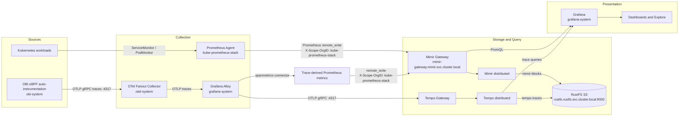
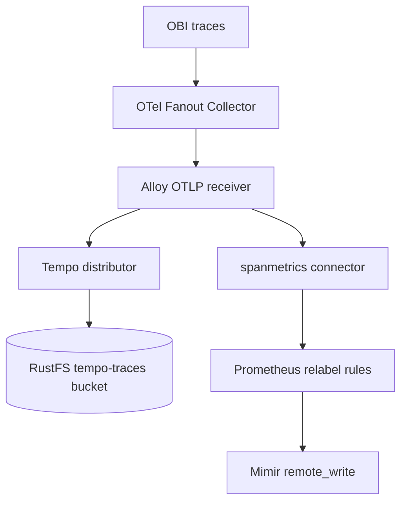
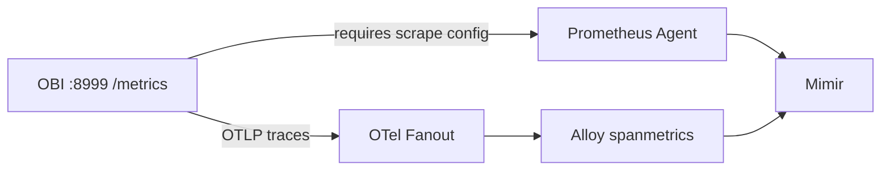
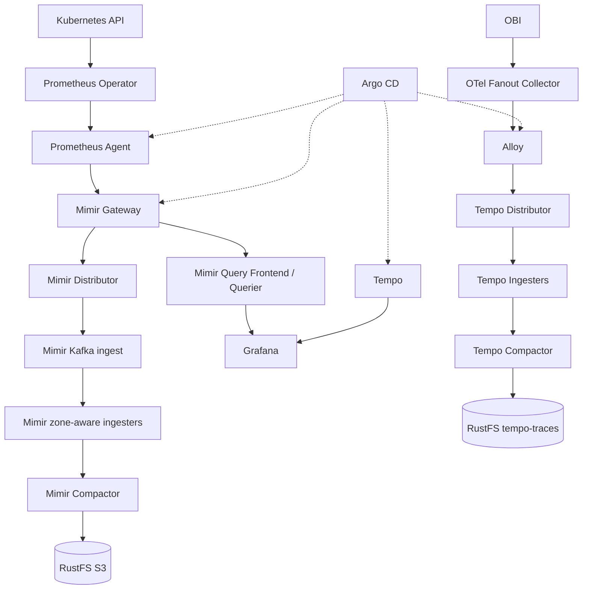

# Observability Data Flow

This document describes how metrics and traces move from workloads through Prometheus, OBI, Alloy, Mimir, Tempo, RustFS S3, and Grafana.

## System Overview



## Metrics Flow

1. Kubernetes workloads expose Prometheus-format metrics.
2. Prometheus Agent discovers targets through `ServiceMonitor` and `PodMonitor` resources supplied by the kube-prometheus-stack operator.
3. Prometheus sends samples to:

   `http://mimir-gateway.mimir.svc.cluster.local/api/v1/push`

4. Prometheus sets `X-Scope-OrgID: kube-prometheus-stack`.
5. Mimir gateway routes writes to distributors.
6. Mimir distributes samples through its ingest path, including Kafka and zone-aware ingesters.
7. Mimir compacts metric blocks and stores them in RustFS S3 bucket `mimir-blocks`.
8. Grafana queries Mimir through its Prometheus-compatible API.

Grafana datasource configuration:

```text
Name: Mimir
Type: prometheus
Access: proxy
URL: http://mimir-gateway.mimir.svc.cluster.local/prometheus
Header: X-Scope-OrgID: kube-prometheus-stack
```

## OBI Trace Flow

OBI runs eBPF-based automatic instrumentation. Current discovery targets:

- `media-stack`
- `immich`
- `homarr`
- `ddns`
- `cloudflared`

OBI exports traces to:

```text
http://otel-fanout-collector.otel-system.svc.cluster.local:4317
```

The fanout collector sends traces to Alloy. Alloy then performs two operations:



Alloy generates metrics such as:

- `traces_spanmetrics_calls_total`
- `traces_spanmetrics_duration_seconds_*`

Alloy sends those metrics to Mimir using:

```text
http://mimir-gateway.mimir.svc.cluster.local/api/v1/push
X-Scope-OrgID: kube-prometheus-stack
```

This means OBI trace-derived metrics appear in Grafana through the Mimir datasource, while original traces appear through the Tempo datasource.

## Direct OBI Metrics

OBI also exposes metrics directly:

```text
Port: 8999
Path: /metrics
Features: network, application
```

These metrics require a Prometheus scrape target for the OBI endpoint. The OBI configuration exposes the endpoint, but a matching `ServiceMonitor`, `PodMonitor`, or scrape configuration must exist before direct OBI metrics enter Prometheus and Mimir.

Direct OBI metrics and Alloy-generated spanmetrics are separate paths:



## Trace Queries and Service Map

Grafana has two relevant datasources:

```text
Mimir: uid=mimir
Tempo: uid=tempo
```

The Tempo datasource points to:

```text
http://tempo-gateway.grafana-system.svc.cluster.local
```

Tempo's service-map configuration references Mimir datasource UID `mimir`. Grafana therefore uses Tempo for trace data and Mimir for service-map metrics derived from traces.

## Object Storage

Mimir stores metric blocks in RustFS through the internal endpoint:

```text
rustfs.rustfs.svc.cluster.local:9000
```

Tempo stores trace blocks in the `tempo-traces` bucket using the same internal RustFS service path.

Configured Mimir metric retention:

```yaml
limits:
  compactor_blocks_retention_period: 30d
```

The Prometheus Agent's local storage is temporary `emptyDir` storage with a configured `10d` retention value. It is a buffering layer, not durable long-term storage. Durable retention is controlled by Mimir's compactor and S3 blocks.

## Dependency Graph



## Verification Commands

Check workload health:

```bash
kubectl get pods -n kube-prometheus-stack
kubectl get pods -n grafana-system
kubectl get pods -n mimir
```

Check GitOps health:

```bash
kubectl get application -n argocd kube-prometheus-stack grafana alloy tempo mimir
```

Check Mimir query access with correct tenant:

```bash
kubectl run mimir-check -n grafana-system --rm -i --restart=Never \
  --image=curlimages/curl:8.10.1 -- \
  curl -sS -H 'X-Scope-OrgID: kube-prometheus-stack' \
  'http://mimir-gateway.mimir.svc.cluster.local/prometheus/api/v1/query?query=up'
```

Expected result is HTTP `200` with a non-empty vector when Prometheus is scraping targets.

Check trace-derived metrics:

```text
traces_spanmetrics_calls_total
```

Check Tempo trace ingestion through Grafana Explore or Tempo's trace search. Check service-map metrics through the Mimir datasource.

## Known Failure Modes

- Missing `X-Scope-OrgID` sends Alloy samples to the `anonymous` tenant while Grafana queries `kube-prometheus-stack`.
- External S3 ingress failures can prevent Tempo or Mimir components from starting. Internal RustFS service DNS avoids that ingress dependency.
- Prometheus Agent memory pressure can cause `OOMKilled`, readiness failures, out-of-order sample drops, and missing data in Mimir.
- OBI direct metrics remain absent unless Prometheus scrapes OBI port `8999`.
