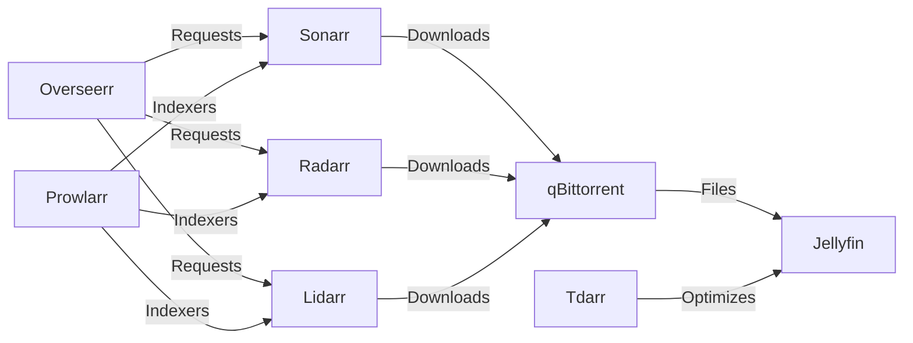

```bash
kubectl create secret generic nordvpn-credentials \
  --namespace=media-stack \
  --type=Opaque \
  --from-literal=OPENVPN_USER='x' \
  --from-literal=OPENVPN_PASSWORD='x' \
  --from-literal=WIREGUARD_PRIVATE_KEY='your_private_key_here'
```

```bash
kubectl patch secret nordvpn-credentials --namespace=media-stack \
  --type='json' -p='[{"op" : "add" , "path" : "/data/WIREGUARD_PRIVATE_KEY" , "value" : "'$(echo -n 'your_private_key_here' | base64 -w0)'" }]'
```


## How To Get Your PRIVATE_KEY for wireguard
- https://github.com/bubuntux/nordlynx?tab=readme-ov-file#how-to-get-your-private_key
```bash
docker run --rm --cap-add=NET_ADMIN -e TOKEN={{{TOKEN}}} ghcr.io/bubuntux/nordvpn:get_private_key
```