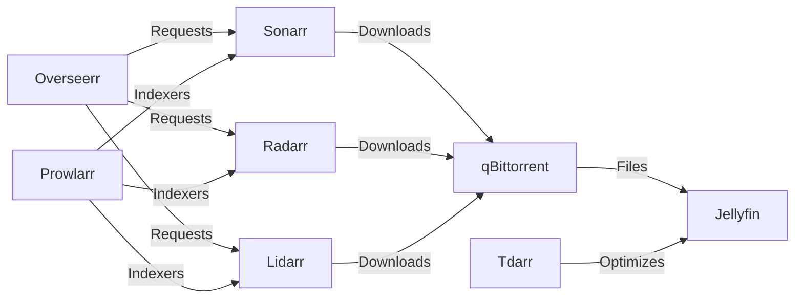

```mermaid
graph LR
    Overseerr -->|Requests| Sonarr
    Overseerr -->|Requests| Radarr
    Overseerr -->|Requests| Lidarr
    Prowlarr -->|Indexers| Sonarr
    Prowlarr -->|Indexers| Radarr
    Prowlarr -->|Indexers| Lidarr
    Sonarr -->|Downloads| qBittorrent
    Radarr -->|Downloads| qBittorrent
    Lidarr -->|Downloads| qBittorrent
    qBittorrent -->|Files| Jellyfin
    Tdarr -->|Optimizes| Jellyfin
```

```bash
kubectl create secret generic nordvpn-credentials \
  --namespace=media-stack \
  --type=Opaque \
  --from-literal=OPENVPN_USER='x' \
  --from-literal=OPENVPN_PASSWORD='x' \
  --from-literal=WIREGUARD_PRIVATE_KEY='your_private_key_here'
```

```bash
kubectl patch secret nordvpn-credentials --namespace=media-stack \
  --type='json' -p='[{"op" : "add" , "path" : "/data/WIREGUARD_PRIVATE_KEY" , "value" : "'$(echo -n 'your_private_key_here' | base64 -w0)'" }]'
```