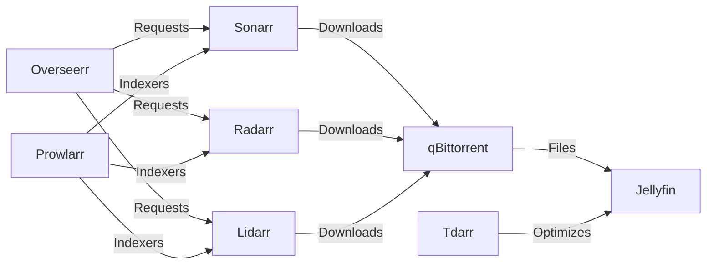

```mermaid
graph LR
    Overseerr -->|Requests| Sonarr
    Overseerr -->|Requests| Radarr
    Overseerr -->|Requests| Lidarr
    Prowlarr -->|Indexers| Sonarr
    Prowlarr -->|Indexers| Radarr
    Prowlarr -->|Indexers| Lidarr
    Sonarr -->|Downloads| qBittorrent
    Radarr -->|Downloads| qBittorrent
    Lidarr -->|Downloads| qBittorrent
    qBittorrent -->|Files| Jellyfin
    Tdarr -->|Optimizes| Jellyfin
```

```bash
kubectl create secret generic nordvpn-credentials \
  --namespace=media-stack \
  --type=Opaque \
  --from-literal=OPENVPN_USER='x' \
  --from-literal=OPENVPN_PASSWORD='x'
```