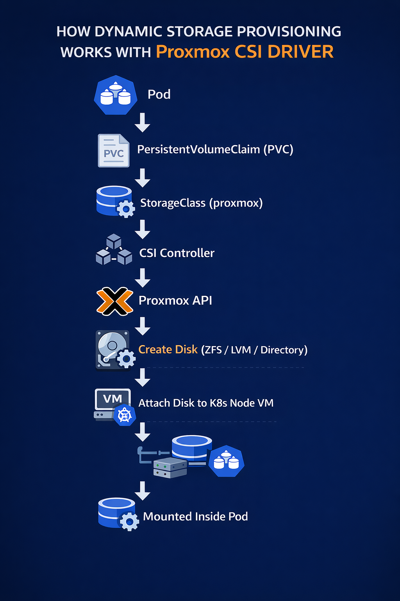

# 🚀 Proxmox VE CSI Driver on Kubernetes

<p align="center">
  
</p>

<p align="center">
  
  
  
</p>

---

## 📋 Table of Contents

- [Prerequisites](#prerequisites)
- [Configuration](#configuration)
- [Create CSI Role and User](#create-csi-role-and-user-in-proxmox)
- [Deploy CSI Driver](#deploy-proxmox-csi-driver-controller)

---

## ✅ Prerequisites

| Tool                                                                                                   | Description              | Required |
| ------------------------------------------------------------------------------------------------------ | ------------------------ | -------- |
| [Proxmox VE](https://pve.proxmox.com/wiki/Main_Page)                                                   | Virtualization platform  | ✅       |
| [Kubernetes Cluster on Proxmox](https://github.com/codesenju/kubelab/tree/main/tofu)                   | K8s cluster              | ✅       |
| [OpenTofu](https://opentofu.org/docs/intro/install/)                                                   | Infrastructure as Code   | ✅       |
| [Ansible](https://docs.ansible.com/projects/ansible/latest/installation_guide/intro_installation.html) | Configuration management | ✅       |

> 💡 **Tip:** I manage my S3 state using [DriveS3](https://drives3.iysynergy) bucket - Exposes Google Drive to S3 compatible API. Free to use.

---

## ⚙️ Configuration

### Create `.env` file with Proxmox credentials

```bash
cat << EOF > .env
# Proxmox
PROXMOX_VE_ENDPOINT=https://192.168.0.5:8006
PROXMOX_VE_USERNAME=root@pam
PROXMOX_VE_PASSWORD=TopSecretPassword
EOF
```

### Load environment variables

```bash
export $(grep -v '^#' .env | xargs)
```

---

## 🔐 Create CSI Role and User in Proxmox

Create a role with correct privileges to allocate and attach disks.

### 1. Apply OpenTofu

```bash
# Select or create workspace
tofu workspace select -or-create <environment>

# Apply configuration
tofu apply --auto-approve
```

### 2. Retrieve user token

```bash
export PROXMOX_TOKEN_FULL=$(tofu output -raw token)
export PROXMOX_TOKEN_ID=$(echo $PROXMOX_TOKEN_FULL | cut -d= -f1)
export PROXMOX_TOKEN_SECRET=$(echo $PROXMOX_TOKEN_FULL | cut -d= -f2)
```

### 3. Create OpenTofu secrets file

```bash
mkdir -p group_vars/all/

cat <<EOF > group_vars/all/secrets.yaml
proxmox_endpoint: $PROXMOX_VE_ENDPOINT
proxmox_token_secret: $PROXMOX_TOKEN_SECRET
proxmox_token_id: $PROXMOX_TOKEN_ID
EOF
```

---

## 🚦 Deploy Proxmox CSI Driver Controller

> **Choose your deployment method:**

| Method             | Command                                 | Description                           |
| ------------------ | --------------------------------------- | ------------------------------------- |
| **Manifest files** | `ansible-playbook main.yml -t manifest` | Deploy using raw Kubernetes manifests |
| **ArgoCD**         | `ansible-playbook main.yml -t argocd`   | Deploy and manage with ArgoCD         |

---

## 📚 Reference

- [Proxmox CSI Plugin Documentation](https://github.com/sergelogvinov/proxmox-csi-plugin/blob/main/docs/install.md)

---

<p align="center">
  <sub>Built with ❤️ for the Kubernetes community</sub>
</p>
